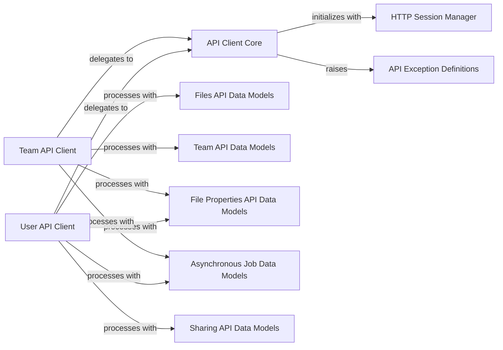

## Component Details

This component graph illustrates the architecture of the Dropbox API client library, focusing on how different modules collaborate to provide a robust interface for interacting with the Dropbox API. The core functionality revolves around the `API Client Core`, which manages low-level HTTP communication, authentication, and error handling. This core interacts with an `HTTP Session Manager` for secure connections and leverages `API Exception Definitions` for structured error reporting. Building upon this foundation, `User API Client` and `Team API Client` offer high-level interfaces for user-specific and team-specific operations, respectively. Both client types utilize various `Data Model` components (Files, Team, File Properties, Asynchronous Job, Sharing) to represent API request arguments and response structures, ensuring type safety and ease of use for developers.

### API Client Core
This component is the foundational layer for all API interactions. It handles the low-level details of making HTTP requests, managing authentication tokens (including refreshing expired ones), implementing retry logic for transient errors (5xx, rate limits), and parsing raw API responses into structured data or raising appropriate exceptions.

**Related Classes/Methods**:

- <a href="https://github.com/dropbox/dropbox-sdk-python/blob/master/dropbox/dropbox_client.py#L120-L722" target="_blank" rel="noopener noreferrer">`dropbox.dropbox_client._DropboxTransport` (120:722)</a>
- <a href="https://github.com/dropbox/dropbox-sdk-python/blob/master/dropbox/dropbox_client.py#L100-L118" target="_blank" rel="noopener noreferrer">`dropbox.dropbox_client.create_session` (100:118)</a>
- <a href="https://github.com/dropbox/dropbox-sdk-python/blob/master/dropbox/dropbox_client.py#L68-L85" target="_blank" rel="noopener noreferrer">`dropbox.dropbox_client.RouteResult` (68:85)</a>
- <a href="https://github.com/dropbox/dropbox-sdk-python/blob/master/dropbox/dropbox_client.py#L87-L98" target="_blank" rel="noopener noreferrer">`dropbox.dropbox_client.RouteErrorResult` (87:98)</a>
- <a href="https://github.com/dropbox/dropbox-sdk-python/blob/master/dropbox/dropbox_client.py#L793-L800" target="_blank" rel="noopener noreferrer">`dropbox.dropbox_client.BadInputException` (793:800)</a>
- <a href="https://github.com/dropbox/dropbox-sdk-python/blob/master/dropbox/base.py#L31-L1000" target="_blank" rel="noopener noreferrer">`dropbox.base.DropboxBase` (31:1000)</a>
- <a href="https://github.com/dropbox/dropbox-sdk-python/blob/master/dropbox/base_team.py#L31-L1000" target="_blank" rel="noopener noreferrer">`dropbox.base_team.DropboxTeamBase` (31:1000)</a>

### User API Client
This component provides the primary interface for applications to interact with the Dropbox API on behalf of a specific user. It exposes methods for common user-centric operations like file management, sharing, and account information. It builds upon the core transport layer.

**Related Classes/Methods**:

- <a href="https://github.com/dropbox/dropbox-sdk-python/blob/master/dropbox/dropbox_client.py#L725-L731" target="_blank" rel="noopener noreferrer">`dropbox.dropbox_client.Dropbox` (725:731)</a>
- <a href="https://github.com/dropbox/dropbox-sdk-python/blob/master/dropbox/base.py#L31-L1000" target="_blank" rel="noopener noreferrer">`dropbox.base.DropboxBase` (31:1000)</a>

### Team API Client
This component offers an interface for applications to manage Dropbox teams. It includes functionalities for managing team members, groups, team folders, and accessing team-specific reports and logs. It also allows for impersonation of team members or administrators.

**Related Classes/Methods**:

- <a href="https://github.com/dropbox/dropbox-sdk-python/blob/master/dropbox/dropbox_client.py#L733-L791" target="_blank" rel="noopener noreferrer">`dropbox.dropbox_client.DropboxTeam` (733:791)</a>
- <a href="https://github.com/dropbox/dropbox-sdk-python/blob/master/dropbox/base_team.py#L31-L1000" target="_blank" rel="noopener noreferrer">`dropbox.base_team.DropboxTeamBase` (31:1000)</a>

### API Exception Definitions
This component defines a comprehensive set of custom exception classes that represent various error conditions returned by the Dropbox API. These exceptions provide structured information about API failures, allowing applications to handle different error scenarios gracefully.

**Related Classes/Methods**:

- <a href="https://github.com/dropbox/dropbox-sdk-python/blob/master/dropbox/exceptions.py#L14-L33" target="_blank" rel="noopener noreferrer">`dropbox.exceptions.ApiError` (14:33)</a>
- <a href="https://github.com/dropbox/dropbox-sdk-python/blob/master/dropbox/exceptions.py#L71-L79" target="_blank" rel="noopener noreferrer">`dropbox.exceptions.AuthError` (71:79)</a>
- <a href="https://github.com/dropbox/dropbox-sdk-python/blob/master/dropbox/exceptions.py#L60-L68" target="_blank" rel="noopener noreferrer">`dropbox.exceptions.BadInputError` (60:68)</a>
- <a href="https://github.com/dropbox/dropbox-sdk-python/blob/master/dropbox/exceptions.py#L36-L46" target="_blank" rel="noopener noreferrer">`dropbox.exceptions.HttpError` (36:46)</a>
- <a href="https://github.com/dropbox/dropbox-sdk-python/blob/master/dropbox/exceptions.py#L95-L100" target="_blank" rel="noopener noreferrer">`dropbox.exceptions.InternalServerError` (95:100)</a>
- <a href="https://github.com/dropbox/dropbox-sdk-python/blob/master/dropbox/exceptions.py#L49-L57" target="_blank" rel="noopener noreferrer">`dropbox.exceptions.PathRootError` (49:57)</a>
- <a href="https://github.com/dropbox/dropbox-sdk-python/blob/master/dropbox/exceptions.py#L82-L92" target="_blank" rel="noopener noreferrer">`dropbox.exceptions.RateLimitError` (82:92)</a>

### HTTP Session Manager
This component is responsible for creating and managing secure HTTP sessions used for communication with the Dropbox API. It specifically implements SSL certificate pinning to ensure that connections are made only to trusted Dropbox servers, enhancing security.

**Related Classes/Methods**:

- <a href="https://github.com/dropbox/dropbox-sdk-python/blob/master/dropbox/session.py#L53-L67" target="_blank" rel="noopener noreferrer">`dropbox.session.pinned_session` (53:67)</a>
- <a href="https://github.com/dropbox/dropbox-sdk-python/blob/master/dropbox/session.py#L37-L51" target="_blank" rel="noopener noreferrer">`dropbox.session._SSLAdapter` (37:51)</a>

### Files API Data Models
This component comprises the data structures (classes) that define the arguments and return types for all file-related operations in the Dropbox API. These are typically generated from the API's formal specification.

**Related Classes/Methods**:

- <a href="https://github.com/dropbox/dropbox-sdk-python/blob/master/dropbox/files.py#L201-L234" target="_blank" rel="noopener noreferrer">`dropbox.files.AlphaGetMetadataArg` (201:234)</a>
- `dropbox.files.UploadArg` (full file reference)
- `dropbox.files.RelocationArg` (full file reference)
- `dropbox.files.RelocationBatchArgBase` (full file reference)
- `dropbox.files.RelocationBatchArg` (full file reference)
- `dropbox.files.GetCopyReferenceArg` (full file reference)
- `dropbox.files.SaveCopyReferenceArg` (full file reference)
- <a href="https://github.com/dropbox/dropbox-sdk-python/blob/master/dropbox/files.py#L486-L517" target="_blank" rel="noopener noreferrer">`dropbox.files.CreateFolderArg` (486:517)</a>
- <a href="https://github.com/dropbox/dropbox-sdk-python/blob/master/dropbox/files.py#L521-L564" target="_blank" rel="noopener noreferrer">`dropbox.files.CreateFolderBatchArg` (521:564)</a>
- `dropbox.files.DeleteArg` (full file reference)
- `dropbox.files.DeleteBatchArg` (full file reference)
- `dropbox.files.DownloadArg` (full file reference)
- `dropbox.files.DownloadZipArg` (full file reference)
- `dropbox.files.ExportArg` (full file reference)
- `dropbox.files.LockFileBatchArg` (full file reference)
- <a href="https://github.com/dropbox/dropbox-sdk-python/blob/master/dropbox/files.py#L133-L197" target="_blank" rel="noopener noreferrer">`dropbox.files.GetMetadataArg` (133:197)</a>
- `dropbox.files.PreviewArg` (full file reference)
- `dropbox.files.GetTemporaryLinkArg` (full file reference)
- `dropbox.files.GetTemporaryUploadLinkArg` (full file reference)
- `dropbox.files.ThumbnailArg` (full file reference)
- `dropbox.files.ThumbnailV2Arg` (full file reference)
- `dropbox.files.GetThumbnailBatchArg` (full file reference)
- `dropbox.files.ListFolderArg` (full file reference)
- `dropbox.files.ListFolderContinueArg` (full file reference)
- `dropbox.files.ListFolderLongpollArg` (full file reference)
- `dropbox.files.ListRevisionsArg` (full file reference)
- `dropbox.files.MoveBatchArg` (full file reference)
- `dropbox.files.PaperCreateArg` (full file reference)
- `dropbox.files.PaperUpdateArg` (full file reference)
- `dropbox.files.RestoreArg` (full file reference)
- `dropbox.files.SaveUrlArg` (full file reference)
- `dropbox.files.SearchArg` (full file reference)
- `dropbox.files.SearchV2Arg` (full file reference)
- `dropbox.files.SearchV2ContinueArg` (full file reference)
- <a href="https://github.com/dropbox/dropbox-sdk-python/blob/master/dropbox/files.py#L19-L50" target="_blank" rel="noopener noreferrer">`dropbox.files.AddTagArg` (19:50)</a>
- `dropbox.files.GetTagsArg` (full file reference)
- `dropbox.files.RemoveTagArg` (full file reference)
- `dropbox.files.UnlockFileBatchArg` (full file reference)
- `dropbox.files.UploadSessionAppendArg` (full file reference)
- `dropbox.files.UploadSessionCursor` (full file reference)
- `dropbox.files.UploadSessionFinishArg` (full file reference)
- `dropbox.files.UploadSessionFinishBatchArg` (full file reference)
- `dropbox.files.UploadSessionStartArg` (full file reference)
- `dropbox.files.UploadSessionStartBatchArg` (full file reference)
- `dropbox.files.WriteMode` (full file reference)

### Team API Data Models
This component defines the data structures (classes) for arguments and return types specific to team management operations within the Dropbox API.

**Related Classes/Methods**:

- `dropbox.team.ListMemberDevicesArg` (full file reference)
- `dropbox.team.ListMembersDevicesArg` (full file reference)
- `dropbox.team.ListTeamDevicesArg` (full file reference)
- `dropbox.team.RevokeDeviceSessionBatchArg` (full file reference)
- `dropbox.team.FeaturesGetValuesBatchArg` (full file reference)
- `dropbox.team.GroupCreateArg` (full file reference)
- `dropbox.team.GroupsListArg` (full file reference)
- `dropbox.team.GroupsListContinueArg` (full file reference)
- `dropbox.team.GroupMembersAddArg` (full file reference)
- `dropbox.team.GroupsMembersListArg` (full file reference)
- `dropbox.team.GroupsMembersListContinueArg` (full file reference)
- `dropbox.team.GroupMembersRemoveArg` (full file reference)
- `dropbox.team.GroupMembersSetAccessTypeArg` (full file reference)
- `dropbox.team.GroupUpdateArgs` (full file reference)
- `dropbox.team.LegalHoldsPolicyCreateArg` (full file reference)
- `dropbox.team.LegalHoldsGetPolicyArg` (full file reference)
- `dropbox.team.LegalHoldsListHeldRevisionsArg` (full file reference)
- `dropbox.team.LegalHoldsListHeldRevisionsContinueArg` (full file reference)
- `dropbox.team.LegalHoldsListPoliciesArg` (full file reference)
- `dropbox.team.LegalHoldsPolicyReleaseArg` (full file reference)
- `dropbox.team.LegalHoldsPolicyUpdateArg` (full file reference)
- `dropbox.team.ListMemberAppsArg` (full file reference)
- `dropbox.team.ListMembersAppsArg` (full file reference)
- `dropbox.team.ListTeamAppsArg` (full file reference)
- `dropbox.team.RevokeLinkedApiAppArg` (full file reference)
- `dropbox.team.RevokeLinkedApiAppBatchArg` (full file reference)
- `dropbox.team.ExcludedUsersUpdateArg` (full file reference)
- `dropbox.team.ExcludedUsersListArg` (full file reference)
- `dropbox.team.ExcludedUsersListContinueArg` (full file reference)
- <a href="https://github.com/dropbox/dropbox-sdk-python/blob/master/dropbox/team.py#L991-L1000" target="_blank" rel="noopener noreferrer">`dropbox.team.CustomQuotaUsersArg` (991:1000)</a>
- `dropbox.team.SetCustomQuotaArg` (full file reference)
- `dropbox.team.MembersAddV2Arg` (full file reference)
- `dropbox.team.MembersAddArg` (full file reference)
- `dropbox.team.MembersDeleteProfilePhotoArg` (full file reference)
- `dropbox.team.MembersGetInfoV2Arg` (full file reference)
- `dropbox.team.MembersGetInfoArgs` (full file reference)
- `dropbox.team.MembersListArg` (full file reference)
- `dropbox.team.MembersListContinueArg` (full file reference)
- `dropbox.team.MembersDataTransferArg` (full file reference)
- `dropbox.team.MembersRecoverArg` (full file reference)
- `dropbox.team.MembersRemoveArg` (full file reference)
- <a href="https://github.com/dropbox/dropbox-sdk-python/blob/master/dropbox/team.py#L478-L500" target="_blank" rel="noopener noreferrer">`dropbox.team.AddSecondaryEmailsArg` (478:500)</a>
- `dropbox.team.DeleteSecondaryEmailsArg` (full file reference)
- `dropbox.team.ResendVerificationEmailArg` (full file reference)
- `dropbox.team.MembersSetPermissions2Arg` (full file reference)
- `dropbox.team.MembersSetPermissionsArg` (full file reference)
- `dropbox.team.MembersSetProfileArg` (full file reference)
- `dropbox.team.MembersSetProfilePhotoArg` (full file reference)
- `dropbox.team.MembersDeactivateArg` (full file reference)
- `dropbox.team.MembersUnsuspendArg` (full file reference)
- `dropbox.team.TeamNamespacesListArg` (full file reference)
- `dropbox.team.TeamNamespacesListContinueArg` (full file reference)
- `dropbox.team.DateRange` (full file reference)
- `dropbox.team.SharingAllowlistAddArgs` (full file reference)
- `dropbox.team.SharingAllowlistListArg` (full file reference)
- `dropbox.team.SharingAllowlistListContinueArg` (full file reference)
- `dropbox.team.SharingAllowlistRemoveArgs` (full file reference)
- `dropbox.team.TeamFolderIdArg` (full file reference)
- `dropbox.team.TeamFolderArchiveArg` (full file reference)
- `dropbox.team.TeamFolderCreateArg` (full file reference)
- `dropbox.team.TeamFolderIdListArg` (full file reference)
- `dropbox.team.TeamFolderListArg` (full file reference)
- `dropbox.team.TeamFolderListContinueArg` (full file reference)
- `dropbox.team.TeamFolderRenameArg` (full file reference)
- `dropbox.team.TeamFolderUpdateSyncSettingsArg` (full file reference)
- `dropbox.team_log.GetTeamEventsArg` (full file reference)
- `dropbox.team_log.GetTeamEventsContinueArg` (full file reference)

### File Properties API Data Models
This component defines the data structures for managing custom file properties, including adding, updating, removing, and searching for properties.

**Related Classes/Methods**:

- `dropbox.file_properties.AddPropertiesArg` (full file reference)
- `dropbox.file_properties.OverwritePropertyGroupArg` (full file reference)
- `dropbox.file_properties.RemovePropertiesArg` (full file reference)
- `dropbox.file_properties.PropertiesSearchArg` (full file reference)
- `dropbox.file_properties.PropertiesSearchContinueArg` (full file reference)
- `dropbox.file_properties.UpdatePropertiesArg` (full file reference)
- `dropbox.file_properties.AddTemplateArg` (full file reference)
- `dropbox.file_properties.GetTemplateArg` (full file reference)
- `dropbox.file_properties.RemoveTemplateArg` (full file reference)
- `dropbox.file_properties.UpdateTemplateArg` (full file reference)

### Asynchronous Job Data Models
This component provides data structures for handling asynchronous API operations, particularly for polling the status of long-running jobs.

**Related Classes/Methods**:

- <a href="https://github.com/dropbox/dropbox-sdk-python/blob/master/dropbox/async_.py#L96-L120" target="_blank" rel="noopener noreferrer">`dropbox.async_.PollArg` (96:120)</a>
- <a href="https://github.com/dropbox/dropbox-sdk-python/blob/master/dropbox/async_.py#L66-L92" target="_blank" rel="noopener noreferrer">`dropbox.async_.LaunchEmptyResult` (66:92)</a>
- <a href="https://github.com/dropbox/dropbox-sdk-python/blob/master/dropbox/async_.py#L156-L181" target="_blank" rel="noopener noreferrer">`dropbox.async_.PollEmptyResult` (156:181)</a>

### Sharing API Data Models
This component defines the data structures for managing shared files and folders, including creating shared links, adding/removing members, and modifying sharing policies.

**Related Classes/Methods**:

- `dropbox.sharing.AddFileMemberArgs` (full file reference)
- `dropbox.sharing.AddFolderMemberArg` (full file reference)
- `dropbox.sharing.CreateSharedLinkArg` (full file reference)
- `dropbox.sharing.CreateSharedLinkWithSettingsArg` (full file reference)
- `dropbox.sharing.GetFileMetadataArg` (full file reference)
- `dropbox.sharing.GetFileMetadataBatchArg` (full file reference)
- `dropbox.sharing.GetMetadataArgs` (full file reference)
- `dropbox.sharing.GetSharedLinkMetadataArg` (full file reference)
- `dropbox.sharing.GetSharedLinksArg` (full file reference)
- `dropbox.sharing.ListFileMembersArg` (full file reference)
- `dropbox.sharing.ListFileMembersBatchArg` (full file reference)
- `dropbox.sharing.ListFileMembersContinueArg` (full file reference)
- `dropbox.sharing.ListFolderMembersArgs` (full file reference)
- `dropbox.sharing.ListFolderMembersContinueArg` (full file reference)
- `dropbox.sharing.ListFoldersArgs` (full file reference)
- `dropbox.sharing.ListFoldersContinueArg` (full file reference)
- `dropbox.sharing.ListFilesArg` (full file reference)
- `dropbox.sharing.ListFilesContinueArg` (full file reference)
- `dropbox.sharing.ListSharedLinksArg` (full file reference)
- `dropbox.sharing.ModifySharedLinkSettingsArgs` (full file reference)
- `dropbox.sharing.MountFolderArg` (full file reference)
- `dropbox.sharing.RelinquishFileMembershipArg` (full file reference)
- `dropbox.sharing.RelinquishFolderMembershipArg` (full file reference)
- `dropbox.sharing.RemoveFileMemberArg` (full file reference)
- `dropbox.sharing.RemoveFolderMemberArg` (full file reference)
- `dropbox.sharing.RevokeSharedLinkArg` (full file reference)
- `dropbox.sharing.SetAccessInheritanceArg` (full file reference)
- `dropbox.sharing.ShareFolderArg` (full file reference)
- `dropbox.sharing.TransferFolderArg` (full file reference)
- `dropbox.sharing.UnmountFolderArg` (full file reference)
- `dropbox.sharing.UnshareFileArg` (full file reference)
- `dropbox.sharing.UnshareFolderArg` (full file reference)
- `dropbox.sharing.UpdateFileMemberArgs` (full file reference)
- `dropbox.sharing.UpdateFolderMemberArg` (full file reference)
- `dropbox.sharing.UpdateFolderPolicyArg` (full file reference)

### [FAQ](https://github.com/CodeBoarding/GeneratedOnBoardings/tree/main?tab=readme-ov-file#faq)