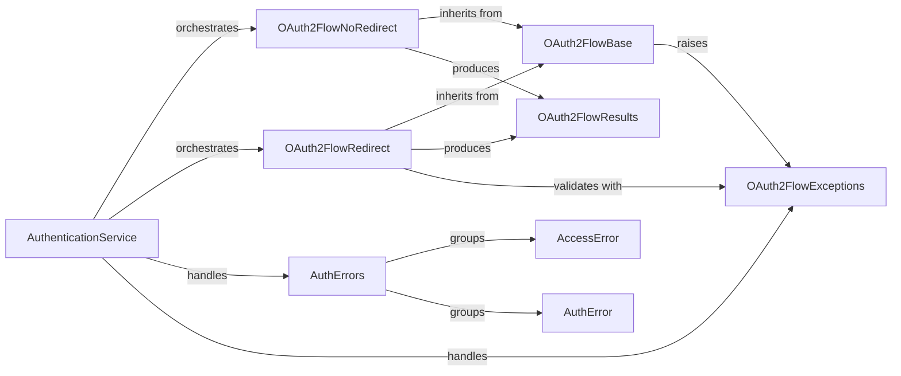

## Component Details

The AuthenticationService subsystem in Dropbox manages secure user authentication and authorization using OAuth2, including PKCE. It provides distinct flows for redirect-based (web) and no-redirect (command-line) applications, ensuring proper handling of authorization codes, access tokens, and refresh tokens. The subsystem also defines a comprehensive set of exceptions to manage various authentication and access-related errors, providing clear error handling for different failure scenarios.

### AuthenticationService
Manages user authentication and authorization flows, including OAuth2 and PKCE, and defines various authentication-related errors. It ensures secure access to Dropbox resources.

**Related Classes/Methods**:

- <a href="https://github.com/dropbox/dropbox-sdk-python/blob/master/dropbox/oauth.py#L119-L263" target="_blank" rel="noopener noreferrer">`dropbox.oauth.DropboxOAuth2FlowBase` (119:263)</a>
- <a href="https://github.com/dropbox/dropbox-sdk-python/blob/master/dropbox/oauth.py#L266-L350" target="_blank" rel="noopener noreferrer">`dropbox.oauth.DropboxOAuth2FlowNoRedirect` (266:350)</a>
- <a href="https://github.com/dropbox/dropbox-sdk-python/blob/master/dropbox/oauth.py#L353-L536" target="_blank" rel="noopener noreferrer">`dropbox.oauth.DropboxOAuth2Flow` (353:536)</a>
- <a href="https://github.com/dropbox/dropbox-sdk-python/blob/master/dropbox/auth.py#L10-L100" target="_blank" rel="noopener noreferrer">`dropbox.auth.AccessError` (10:100)</a>
- <a href="https://github.com/dropbox/dropbox-sdk-python/blob/master/dropbox/auth.py#L104-L229" target="_blank" rel="noopener noreferrer">`dropbox.auth.AuthError` (104:229)</a>

### OAuth2FlowBase
This component provides the foundational logic for all OAuth2 authorization flows, handling common tasks like URL construction, parameter encoding, and PKCE (Proof Key for Code Exchange) operations. It serves as the base class for specific flow implementations.

**Related Classes/Methods**:

- <a href="https://github.com/dropbox/dropbox-sdk-python/blob/master/dropbox/oauth.py#L119-L263" target="_blank" rel="noopener noreferrer">`dropbox.oauth.DropboxOAuth2FlowBase` (119:263)</a>
- <a href="https://github.com/dropbox/dropbox-sdk-python/blob/master/dropbox/oauth.py#L604-L622" target="_blank" rel="noopener noreferrer">`dropbox.oauth._params_to_urlencoded` (604:622)</a>
- <a href="https://github.com/dropbox/dropbox-sdk-python/blob/master/dropbox/oauth.py#L624-L629" target="_blank" rel="noopener noreferrer">`dropbox.oauth._generate_pkce_code_verifier` (624:629)</a>
- <a href="https://github.com/dropbox/dropbox-sdk-python/blob/master/dropbox/oauth.py#L631-L635" target="_blank" rel="noopener noreferrer">`dropbox.oauth._generate_pkce_code_challenge` (631:635)</a>

### OAuth2FlowNoRedirect
This component specializes in OAuth2 authorization for applications that do not use a redirect URI, such as command-line tools. It extends the base OAuth2 flow functionality to support this specific use case.

**Related Classes/Methods**:

- <a href="https://github.com/dropbox/dropbox-sdk-python/blob/master/dropbox/oauth.py#L266-L350" target="_blank" rel="noopener noreferrer">`dropbox.oauth.DropboxOAuth2FlowNoRedirect` (266:350)</a>

### OAuth2FlowRedirect
This component handles OAuth2 authorization for web applications that rely on a redirect URI. It includes mechanisms for CSRF protection and manages the state throughout the authorization process.

**Related Classes/Methods**:

- <a href="https://github.com/dropbox/dropbox-sdk-python/blob/master/dropbox/oauth.py#L353-L536" target="_blank" rel="noopener noreferrer">`dropbox.oauth.DropboxOAuth2Flow` (353:536)</a>
- <a href="https://github.com/dropbox/dropbox-sdk-python/blob/master/dropbox/oauth.py#L595-L601" target="_blank" rel="noopener noreferrer">`dropbox.oauth._safe_equals` (595:601)</a>

### OAuth2FlowResults
This component defines the data structures used to encapsulate the results of successful OAuth2 authorization flows. OAuth2FlowNoRedirectResult is a general result type, and OAuth2FlowResult is a specific result that inherits from it, providing access tokens, account information, and other relevant details.

**Related Classes/Methods**:

- <a href="https://github.com/dropbox/dropbox-sdk-python/blob/master/dropbox/oauth.py#L80-L116" target="_blank" rel="noopener noreferrer">`dropbox.oauth.OAuth2FlowResult` (80:116)</a>
- <a href="https://github.com/dropbox/dropbox-sdk-python/blob/master/dropbox/oauth.py#L40-L77" target="_blank" rel="noopener noreferrer">`dropbox.oauth.OAuth2FlowNoRedirectResult` (40:77)</a>

### OAuth2FlowExceptions
This component groups all exceptions specific to the OAuth2 authorization process, providing distinct error types for various failure scenarios like bad input, invalid requests, state mismatches, or user denial.

**Related Classes/Methods**:

- <a href="https://github.com/dropbox/dropbox-sdk-python/blob/master/dropbox/oauth.py#L585-L592" target="_blank" rel="noopener noreferrer">`dropbox.oauth.BadInputException` (585:592)</a>
- <a href="https://github.com/dropbox/dropbox-sdk-python/blob/master/dropbox/oauth.py#L539-L545" target="_blank" rel="noopener noreferrer">`dropbox.oauth.BadRequestException` (539:545)</a>
- <a href="https://github.com/dropbox/dropbox-sdk-python/blob/master/dropbox/oauth.py#L548-L555" target="_blank" rel="noopener noreferrer">`dropbox.oauth.BadStateException` (548:555)</a>
- <a href="https://github.com/dropbox/dropbox-sdk-python/blob/master/dropbox/oauth.py#L558-L565" target="_blank" rel="noopener noreferrer">`dropbox.oauth.CsrfException` (558:565)</a>
- <a href="https://github.com/dropbox/dropbox-sdk-python/blob/master/dropbox/oauth.py#L568-L572" target="_blank" rel="noopener noreferrer">`dropbox.oauth.NotApprovedException` (568:572)</a>
- <a href="https://github.com/dropbox/dropbox-sdk-python/blob/master/dropbox/oauth.py#L575-L582" target="_blank" rel="noopener noreferrer">`dropbox.oauth.ProviderException` (575:582)</a>

### AuthErrors
This component defines exceptions related to general authentication and access control, distinct from the OAuth2 flow-specific errors.

**Related Classes/Methods**:

- <a href="https://github.com/dropbox/dropbox-sdk-python/blob/master/dropbox/auth.py#L10-L100" target="_blank" rel="noopener noreferrer">`dropbox.auth.AccessError` (10:100)</a>
- <a href="https://github.com/dropbox/dropbox-sdk-python/blob/master/dropbox/auth.py#L104-L229" target="_blank" rel="noopener noreferrer">`dropbox.auth.AuthError` (104:229)</a>

### [FAQ](https://github.com/CodeBoarding/GeneratedOnBoardings/tree/main?tab=readme-ov-file#faq)