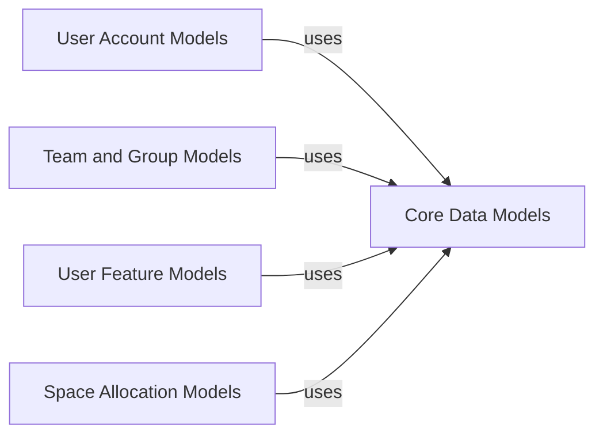

## Component Details

This graph illustrates the core data models and their relationships within the Dropbox SDK. The central component, 'Core Data Models', provides foundational data structures and utility classes that are widely reused. Other components, such as 'User Account Models', 'Team and Group Models', 'User Feature Models', and 'Space Allocation Models', depend on and utilize these core data models to define their specific domain-related structures, ensuring consistency and reusability across the SDK.

### Core Data Models
Contains shared data models and utility classes used across different parts of the Dropbox SDK, promoting consistency and reusability. This includes foundational data structures for path roots, root information (user and team specific), and common data type validators, as well as shared models specific to teams and users.

**Related Classes/Methods**:

- `dropbox.common` (full file reference)
- <a href="https://github.com/dropbox/dropbox-sdk-python/blob/master/dropbox/common.py#L10-L116" target="_blank" rel="noopener noreferrer">`dropbox.common.PathRoot` (10:116)</a>
- `dropbox.common.PathRoot:home` (full file reference)
- <a href="https://github.com/dropbox/dropbox-sdk-python/blob/master/dropbox/common.py#L34-L42" target="_blank" rel="noopener noreferrer">`dropbox.common.PathRoot:root` (34:42)</a>
- <a href="https://github.com/dropbox/dropbox-sdk-python/blob/master/dropbox/common.py#L45-L53" target="_blank" rel="noopener noreferrer">`dropbox.common.PathRoot:namespace_id` (45:53)</a>
- <a href="https://github.com/dropbox/dropbox-sdk-python/blob/master/dropbox/common.py#L87-L99" target="_blank" rel="noopener noreferrer">`dropbox.common.PathRoot:get_root` (87:99)</a>
- <a href="https://github.com/dropbox/dropbox-sdk-python/blob/master/dropbox/common.py#L101-L113" target="_blank" rel="noopener noreferrer">`dropbox.common.PathRoot:get_namespace_id` (101:113)</a>
- <a href="https://github.com/dropbox/dropbox-sdk-python/blob/master/dropbox/common.py#L55-L61" target="_blank" rel="noopener noreferrer">`dropbox.common.PathRoot.is_home` (55:61)</a>
- <a href="https://github.com/dropbox/dropbox-sdk-python/blob/master/dropbox/common.py#L63-L69" target="_blank" rel="noopener noreferrer">`dropbox.common.PathRoot.is_root` (63:69)</a>
- <a href="https://github.com/dropbox/dropbox-sdk-python/blob/master/dropbox/common.py#L71-L77" target="_blank" rel="noopener noreferrer">`dropbox.common.PathRoot.is_namespace_id` (71:77)</a>
- <a href="https://github.com/dropbox/dropbox-sdk-python/blob/master/dropbox/common.py#L120-L188" target="_blank" rel="noopener noreferrer">`dropbox.common.PathRootError` (120:188)</a>
- <a href="https://github.com/dropbox/dropbox-sdk-python/blob/master/dropbox/common.py#L140-L148" target="_blank" rel="noopener noreferrer">`dropbox.common.PathRootError:invalid_root` (140:148)</a>
- `dropbox.common.PathRootError:no_permission` (full file reference)
- <a href="https://github.com/dropbox/dropbox-sdk-python/blob/master/dropbox/common.py#L174-L185" target="_blank" rel="noopener noreferrer">`dropbox.common.PathRootError:get_invalid_root` (174:185)</a>
- <a href="https://github.com/dropbox/dropbox-sdk-python/blob/master/dropbox/common.py#L150-L156" target="_blank" rel="noopener noreferrer">`dropbox.common.PathRootError.is_invalid_root` (150:156)</a>
- <a href="https://github.com/dropbox/dropbox-sdk-python/blob/master/dropbox/common.py#L192-L228" target="_blank" rel="noopener noreferrer">`dropbox.common.RootInfo` (192:228)</a>
- `dropbox.common.RootInfo:root_namespace_id` (full file reference)
- `dropbox.common.RootInfo:home_namespace_id` (full file reference)
- <a href="https://github.com/dropbox/dropbox-sdk-python/blob/master/dropbox/common.py#L232-L260" target="_blank" rel="noopener noreferrer">`dropbox.common.TeamRootInfo` (232:260)</a>
- <a href="https://github.com/dropbox/dropbox-sdk-python/blob/master/dropbox/common.py#L246-L254" target="_blank" rel="noopener noreferrer">`dropbox.common.TeamRootInfo:__init__` (246:254)</a>
- <a href="https://github.com/dropbox/dropbox-sdk-python/blob/master/dropbox/common.py#L259-L260" target="_blank" rel="noopener noreferrer">`dropbox.common.TeamRootInfo:_process_custom_annotations` (259:260)</a>
- <a href="https://github.com/dropbox/dropbox-sdk-python/blob/master/dropbox/common.py#L264-L282" target="_blank" rel="noopener noreferrer">`dropbox.common.UserRootInfo` (264:282)</a>
- <a href="https://github.com/dropbox/dropbox-sdk-python/blob/master/dropbox/common.py#L275-L279" target="_blank" rel="noopener noreferrer">`dropbox.common.UserRootInfo:__init__` (275:279)</a>
- <a href="https://github.com/dropbox/dropbox-sdk-python/blob/master/dropbox/common.py#L281-L282" target="_blank" rel="noopener noreferrer">`dropbox.common.UserRootInfo:_process_custom_annotations` (281:282)</a>
- `dropbox.team_common` (full file reference)
- `dropbox.users_common` (full file reference)

### User Account Models
This component defines the data structures for various types of user accounts, including basic and full account details, and related information like names and account retrieval arguments/errors.

**Related Classes/Methods**:

- `dropbox.users.Account` (full file reference)
- `dropbox.users.Account:__init__` (full file reference)
- `dropbox.users.Account:_process_custom_annotations` (full file reference)
- `dropbox.users.BasicAccount` (full file reference)
- `dropbox.users.BasicAccount:__init__` (full file reference)
- `dropbox.users.BasicAccount:_process_custom_annotations` (full file reference)
- `dropbox.users.FullAccount` (full file reference)
- `dropbox.users.FullAccount:__init__` (full file reference)
- `dropbox.users.FullAccount:_process_custom_annotations` (full file reference)
- `dropbox.users.Name` (full file reference)
- `dropbox.users.GetAccountArg` (full file reference)
- `dropbox.users.GetAccountBatchArg` (full file reference)
- `dropbox.users.GetAccountBatchError` (full file reference)
- `dropbox.users.GetAccountBatchError:no_account` (full file reference)
- `dropbox.users.GetAccountBatchError:get_no_account` (full file reference)
- `dropbox.users.GetAccountBatchError.is_no_account` (full file reference)
- `dropbox.users.GetAccountError` (full file reference)

### Team and Group Models
This component defines data structures for team and group information, including basic team details and full group information. It interacts with an external common group summary for shared processing.

**Related Classes/Methods**:

- `dropbox.users.Team` (full file reference)
- `dropbox.users.Team:__init__` (full file reference)
- `dropbox.users.Team:_process_custom_annotations` (full file reference)
- `dropbox.users.FullTeam` (full file reference)
- `dropbox.users.FullTeam:__init__` (full file reference)
- `dropbox.users.FullTeam:_process_custom_annotations` (full file reference)
- `dropbox.sharing.GroupInfo` (full file reference)
- `dropbox.sharing.GroupInfo:__init__` (full file reference)
- `dropbox.sharing.GroupInfo:_process_custom_annotations` (full file reference)
- `dropbox.team.GroupFullInfo` (full file reference)
- `dropbox.team.GroupFullInfo:__init__` (full file reference)
- `dropbox.team.GroupFullInfo:_process_custom_annotations` (full file reference)

### User Feature Models
This component encapsulates various user-specific features, such as file locking and Paper document handling, defining their possible values and states.

**Related Classes/Methods**:

- `dropbox.users.FileLockingValue` (full file reference)
- `dropbox.users.FileLockingValue:enabled` (full file reference)
- `dropbox.users.FileLockingValue:get_enabled` (full file reference)
- `dropbox.users.FileLockingValue.is_enabled` (full file reference)
- `dropbox.users.PaperAsFilesValue` (full file reference)
- `dropbox.users.PaperAsFilesValue:enabled` (full file reference)
- `dropbox.users.PaperAsFilesValue:get_enabled` (full file reference)
- `dropbox.users.PaperAsFilesValue.is_enabled` (full file reference)
- `dropbox.users.UserFeature` (full file reference)
- `dropbox.users.UserFeatureValue` (full file reference)
- `dropbox.users.UserFeatureValue:paper_as_files` (full file reference)
- `dropbox.users.UserFeatureValue:file_locking` (full file reference)
- `dropbox.users.UserFeatureValue:get_paper_as_files` (full file reference)
- `dropbox.users.UserFeatureValue:get_file_locking` (full file reference)
- `dropbox.users.UserFeatureValue.is_paper_as_files` (full file reference)
- `dropbox.users.UserFeatureValue.is_file_locking` (full file reference)

### Space Allocation Models
This component describes how storage space is allocated and used, differentiating between individual and team-based allocations.

**Related Classes/Methods**:

- `dropbox.users.SpaceAllocation` (full file reference)
- `dropbox.users.SpaceAllocation:individual` (full file reference)
- `dropbox.users.SpaceAllocation:team` (full file reference)
- `dropbox.users.SpaceAllocation:get_individual` (full file reference)
- `dropbox.users.SpaceAllocation:get_team` (full file reference)
- `dropbox.users.SpaceAllocation.is_individual` (full file reference)
- `dropbox.users.SpaceAllocation.is_team` (full file reference)
- `dropbox.users.IndividualSpaceAllocation` (full file reference)
- `dropbox.users.TeamSpaceAllocation` (full file reference)
- `dropbox.users.SpaceUsage` (full file reference)

### [FAQ](https://github.com/CodeBoarding/GeneratedOnBoardings/tree/main?tab=readme-ov-file#faq)