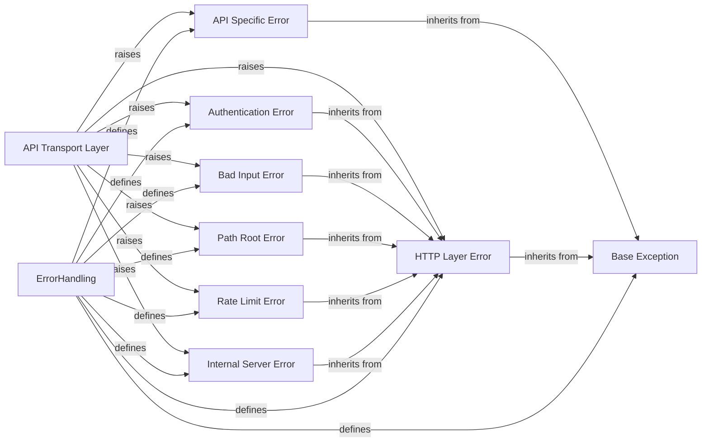

## Component Details

The ErrorHandling subsystem defines a comprehensive hierarchy of custom exceptions within the Dropbox SDK. Its primary purpose is to provide structured error reporting for various API errors and client-side issues. The API Transport Layer is responsible for catching and raising these specific exceptions based on the API responses, ensuring that different types of errors (e.g., API-specific, HTTP-related, authentication, rate limits) are distinctly categorized and handled throughout the SDK.

### ErrorHandling
Defines a hierarchy of custom exceptions used throughout the SDK to represent various API errors and client-side issues, providing structured error reporting.

**Related Classes/Methods**:

- `dropbox.exceptions` (full file reference)
- <a href="https://github.com/dropbox/dropbox-sdk-python/blob/master/dropbox/exceptions.py#L1-L11" target="_blank" rel="noopener noreferrer">`dropbox.exceptions.DropboxException` (1:11)</a>
- <a href="https://github.com/dropbox/dropbox-sdk-python/blob/master/dropbox/exceptions.py#L14-L33" target="_blank" rel="noopener noreferrer">`dropbox.exceptions.ApiError` (14:33)</a>
- <a href="https://github.com/dropbox/dropbox-sdk-python/blob/master/dropbox/exceptions.py#L36-L46" target="_blank" rel="noopener noreferrer">`dropbox.exceptions.HttpError` (36:46)</a>
- <a href="https://github.com/dropbox/dropbox-sdk-python/blob/master/dropbox/exceptions.py#L71-L79" target="_blank" rel="noopener noreferrer">`dropbox.exceptions.AuthError` (71:79)</a>
- <a href="https://github.com/dropbox/dropbox-sdk-python/blob/master/dropbox/exceptions.py#L82-L92" target="_blank" rel="noopener noreferrer">`dropbox.exceptions.RateLimitError` (82:92)</a>

### API Transport Layer
Handles the core logic for making requests to the Dropbox API, including retries, authentication, and error response parsing. This component is responsible for raising appropriate exceptions based on the API response.

**Related Classes/Methods**:

- <a href="https://github.com/dropbox/dropbox-sdk-python/blob/master/dropbox/dropbox_client.py#L120-L722" target="_blank" rel="noopener noreferrer">`dropbox.dropbox_client._DropboxTransport` (120:722)</a>
- <a href="https://github.com/dropbox/dropbox-sdk-python/blob/master/dropbox/dropbox_client.py#L276-L358" target="_blank" rel="noopener noreferrer">`dropbox.dropbox_client._DropboxTransport:request` (276:358)</a>
- <a href="https://github.com/dropbox/dropbox-sdk-python/blob/master/dropbox/dropbox_client.py#L613-L660" target="_blank" rel="noopener noreferrer">`dropbox.dropbox_client._DropboxTransport:raise_dropbox_error_for_resp` (613:660)</a>

### Base Exception
The foundational class for all custom exceptions within the Dropbox SDK, providing a common structure for error handling by including a request ID.

**Related Classes/Methods**:

- <a href="https://github.com/dropbox/dropbox-sdk-python/blob/master/dropbox/exceptions.py#L1-L11" target="_blank" rel="noopener noreferrer">`dropbox.exceptions.DropboxException` (1:11)</a>
- <a href="https://github.com/dropbox/dropbox-sdk-python/blob/master/dropbox/exceptions.py#L4-L8" target="_blank" rel="noopener noreferrer">`dropbox.exceptions.DropboxException:__init__` (4:8)</a>

### API Specific Error
Represents errors returned directly from the Dropbox API, containing detailed error information specific to the API call.

**Related Classes/Methods**:

- <a href="https://github.com/dropbox/dropbox-sdk-python/blob/master/dropbox/exceptions.py#L14-L33" target="_blank" rel="noopener noreferrer">`dropbox.exceptions.ApiError` (14:33)</a>
- <a href="https://github.com/dropbox/dropbox-sdk-python/blob/master/dropbox/exceptions.py#L17-L30" target="_blank" rel="noopener noreferrer">`dropbox.exceptions.ApiError:__init__` (17:30)</a>

### HTTP Layer Error
A base class for exceptions that originate from the HTTP communication layer, such as network issues or general HTTP status codes, including the status code and response body.

**Related Classes/Methods**:

- <a href="https://github.com/dropbox/dropbox-sdk-python/blob/master/dropbox/exceptions.py#L36-L46" target="_blank" rel="noopener noreferrer">`dropbox.exceptions.HttpError` (36:46)</a>
- <a href="https://github.com/dropbox/dropbox-sdk-python/blob/master/dropbox/exceptions.py#L39-L42" target="_blank" rel="noopener noreferrer">`dropbox.exceptions.HttpError:__init__` (39:42)</a>

### Authentication Error
Signifies issues with the provided authentication credentials, such as expired or invalid tokens, inheriting from HTTP Layer Error.

**Related Classes/Methods**:

- <a href="https://github.com/dropbox/dropbox-sdk-python/blob/master/dropbox/exceptions.py#L71-L79" target="_blank" rel="noopener noreferrer">`dropbox.exceptions.AuthError` (71:79)</a>
- <a href="https://github.com/dropbox/dropbox-sdk-python/blob/master/dropbox/exceptions.py#L74-L76" target="_blank" rel="noopener noreferrer">`dropbox.exceptions.AuthError:__init__` (74:76)</a>

### Bad Input Error
Indicates that the request parameters or input provided to the API were invalid or malformed, inheriting from HTTP Layer Error.

**Related Classes/Methods**:

- <a href="https://github.com/dropbox/dropbox-sdk-python/blob/master/dropbox/exceptions.py#L60-L68" target="_blank" rel="noopener noreferrer">`dropbox.exceptions.BadInputError` (60:68)</a>
- <a href="https://github.com/dropbox/dropbox-sdk-python/blob/master/dropbox/exceptions.py#L63-L65" target="_blank" rel="noopener noreferrer">`dropbox.exceptions.BadInputError:__init__` (63:65)</a>

### Path Root Error
A specific error type indicating problems with the Dropbox-API-Path-Root header, inheriting from HTTP Layer Error.

**Related Classes/Methods**:

- <a href="https://github.com/dropbox/dropbox-sdk-python/blob/master/dropbox/exceptions.py#L49-L57" target="_blank" rel="noopener noreferrer">`dropbox.exceptions.PathRootError` (49:57)</a>
- <a href="https://github.com/dropbox/dropbox-sdk-python/blob/master/dropbox/exceptions.py#L52-L54" target="_blank" rel="noopener noreferrer">`dropbox.exceptions.PathRootError:__init__` (52:54)</a>

### Rate Limit Error
Occurs when the application exceeds the allowed number of requests within a given timeframe, inheriting from HTTP Layer Error and potentially including a backoff duration.

**Related Classes/Methods**:

- <a href="https://github.com/dropbox/dropbox-sdk-python/blob/master/dropbox/exceptions.py#L82-L92" target="_blank" rel="noopener noreferrer">`dropbox.exceptions.RateLimitError` (82:92)</a>
- <a href="https://github.com/dropbox/dropbox-sdk-python/blob/master/dropbox/exceptions.py#L85-L88" target="_blank" rel="noopener noreferrer">`dropbox.exceptions.RateLimitError:__init__` (85:88)</a>

### Internal Server Error
Represents an unexpected error on the Dropbox server side, inheriting from HTTP Layer Error.

**Related Classes/Methods**:

- <a href="https://github.com/dropbox/dropbox-sdk-python/blob/master/dropbox/exceptions.py#L95-L100" target="_blank" rel="noopener noreferrer">`dropbox.exceptions.InternalServerError` (95:100)</a>

### [FAQ](https://github.com/CodeBoarding/GeneratedOnBoardings/tree/main?tab=readme-ov-file#faq)