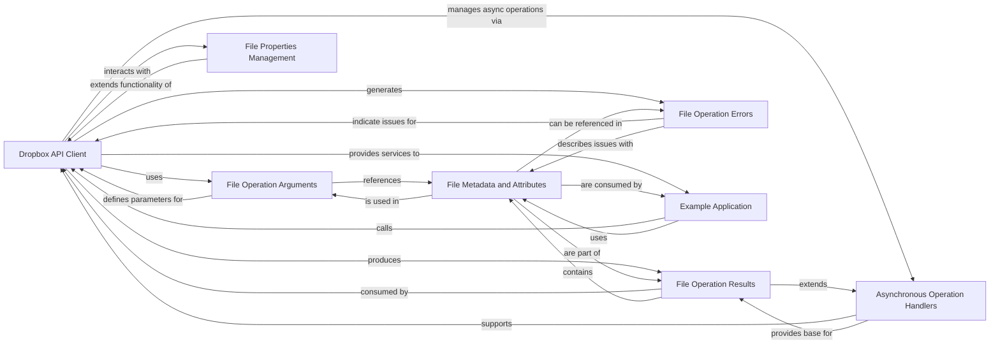

## Component Details

This overview describes the architecture of the FileSystemService, which encapsulates all functionalities for managing files and folders within Dropbox. It details the core components involved in interacting with the Dropbox API for file operations, including argument and result handling, error management, metadata representation, asynchronous processing, and custom file properties. A sample application demonstrates the practical usage of these components.

### Dropbox API Client
This component serves as the primary interface for interacting with the Dropbox API, specifically encapsulating all methods for comprehensive file system operations such as creation, deletion, download, upload, metadata retrieval, search, and file locking. It acts as the central orchestrator for sending requests and receiving responses from the Dropbox service.

**Related Classes/Methods**:

- <a href="https://github.com/dropbox/dropbox-sdk-python/blob/master/dropbox/base.py#L31-L1000" target="_blank" rel="noopener noreferrer">`dropbox.base.DropboxBase` (31:1000)</a>
- <a href="https://github.com/dropbox/dropbox-sdk-python/blob/master/dropbox/base.py#L806-L846" target="_blank" rel="noopener noreferrer">`dropbox.base.DropboxBase:files_alpha_get_metadata` (806:846)</a>
- <a href="https://github.com/dropbox/dropbox-sdk-python/blob/master/dropbox/base.py#L848-L897" target="_blank" rel="noopener noreferrer">`dropbox.base.DropboxBase:files_alpha_upload` (848:897)</a>
- <a href="https://github.com/dropbox/dropbox-sdk-python/blob/master/dropbox/base.py#L899-L935" target="_blank" rel="noopener noreferrer">`dropbox.base.DropboxBase:files_copy_v2` (899:935)</a>
- <a href="https://github.com/dropbox/dropbox-sdk-python/blob/master/dropbox/base.py#L937-L977" target="_blank" rel="noopener noreferrer">`dropbox.base.DropboxBase:files_copy` (937:977)</a>
- <a href="https://github.com/dropbox/dropbox-sdk-python/blob/master/dropbox/base.py#L979-L1000" target="_blank" rel="noopener noreferrer">`dropbox.base.DropboxBase:files_copy_batch_v2` (979:1000)</a>
- `dropbox.base.DropboxBase:files_copy_batch` (full file reference)
- `dropbox.base.DropboxBase:files_copy_batch_check_v2` (full file reference)
- `dropbox.base.DropboxBase:files_copy_batch_check` (full file reference)
- `dropbox.base.DropboxBase:files_copy_reference_get` (full file reference)
- `dropbox.base.DropboxBase:files_copy_reference_save` (full file reference)
- `dropbox.base.DropboxBase:files_create_folder_v2` (full file reference)
- `dropbox.base.DropboxBase:files_create_folder` (full file reference)
- `dropbox.base.DropboxBase:files_create_folder_batch` (full file reference)
- `dropbox.base.DropboxBase:files_create_folder_batch_check` (full file reference)
- `dropbox.base.DropboxBase:files_delete_v2` (full file reference)
- `dropbox.base.DropboxBase:files_delete` (full file reference)
- `dropbox.base.DropboxBase:files_delete_batch` (full file reference)
- `dropbox.base.DropboxBase:files_delete_batch_check` (full file reference)
- `dropbox.base.DropboxBase:files_download` (full file reference)
- `dropbox.base.DropboxBase:files_download_to_file` (full file reference)
- `dropbox.base.DropboxBase:files_download_zip` (full file reference)
- `dropbox.base.DropboxBase:files_download_zip_to_file` (full file reference)
- `dropbox.base.DropboxBase:files_export` (full file reference)
- `dropbox.base.DropboxBase:files_export_to_file` (full file reference)
- `dropbox.base.DropboxBase:files_get_file_lock_batch` (full file reference)
- `dropbox.base.DropboxBase:files_get_metadata` (full file reference)
- `dropbox.base.DropboxBase:files_get_preview` (full file reference)
- `dropbox.base.DropboxBase:files_get_preview_to_file` (full file reference)
- `dropbox.base.DropboxBase:files_get_temporary_link` (full file reference)
- `dropbox.base.DropboxBase:files_get_temporary_upload_link` (full file reference)
- `dropbox.base.DropboxBase:files_get_thumbnail` (full file reference)
- `dropbox.base.DropboxBase:files_get_thumbnail_to_file` (full file reference)
- `dropbox.base.DropboxBase:files_get_thumbnail_v2` (full file reference)
- `dropbox.base.DropboxBase:files_get_thumbnail_to_file_v2` (full file reference)
- `dropbox.base.DropboxBase:files_get_thumbnail_batch` (full file reference)
- `dropbox.base.DropboxBase:files_list_folder` (full file reference)
- `dropbox.base.DropboxBase:files_list_folder_continue` (full file reference)
- `dropbox.base.DropboxBase:files_list_folder_get_latest_cursor` (full file reference)
- `dropbox.base.DropboxBase:files_list_folder_longpoll` (full file reference)
- `dropbox.base.DropboxBase:files_list_revisions` (full file reference)
- `dropbox.base.DropboxBase:files_lock_file_batch` (full file reference)
- `dropbox.base.DropboxBase:files_move_v2` (full file reference)
- `dropbox.base.DropboxBase:files_move` (full file reference)
- `dropbox.base.DropboxBase:files_move_batch_v2` (full file reference)
- `dropbox.base.DropboxBase:files_move_batch` (full file reference)
- `dropbox.base.DropboxBase:files_move_batch_check_v2` (full file reference)
- `dropbox.base.DropboxBase:files_move_batch_check` (full file reference)
- `dropbox.base.DropboxBase:files_paper_create` (full file reference)
- `dropbox.base.DropboxBase:files_paper_update` (full file reference)
- `dropbox.base.DropboxBase:files_permanently_delete` (full file reference)
- `dropbox.base.DropboxBase:files_properties_add` (full file reference)
- `dropbox.base.DropboxBase:files_properties_overwrite` (full file reference)
- `dropbox.base.DropboxBase:files_properties_remove` (full file reference)
- `dropbox.base.DropboxBase:files_properties_template_get` (full file reference)
- `dropbox.base.DropboxBase:files_properties_template_list` (full file reference)
- `dropbox.base.DropboxBase:files_properties_update` (full file reference)
- `dropbox.base.DropboxBase:files_restore` (full file reference)
- `dropbox.base.DropboxBase:files_save_url` (full file reference)
- `dropbox.base.DropboxBase:files_save_url_check_job_status` (full file reference)
- `dropbox.base.DropboxBase:files_search` (full file reference)
- `dropbox.base.DropboxBase:files_search_v2` (full file reference)
- `dropbox.base.DropboxBase:files_search_continue_v2` (full file reference)
- `dropbox.base.DropboxBase:files_tags_add` (full file reference)
- `dropbox.base.DropboxBase:files_tags_get` (full file reference)
- `dropbox.base.DropboxBase:files_tags_remove` (full file reference)
- `dropbox.base.DropboxBase:files_unlock_file_batch` (full file reference)
- `dropbox.base.DropboxBase:files_upload` (full file reference)
- `dropbox.base.DropboxBase:files_upload_session_append_v2` (full file reference)
- `dropbox.base.DropboxBase:files_upload_session_append` (full file reference)
- `dropbox.base.DropboxBase:files_upload_session_finish` (full file reference)
- `dropbox.base.DropboxBase:files_upload_session_finish_batch` (full file reference)
- `dropbox.base.DropboxBase:files_upload_session_finish_batch_v2` (full file reference)
- `dropbox.base.DropboxBase:files_upload_session_finish_batch_check` (full file reference)
- `dropbox.base.DropboxBase:files_upload_session_start` (full file reference)
- `dropbox.base.DropboxBase:files_upload_session_start_batch` (full file reference)
- <a href="https://github.com/dropbox/dropbox-sdk-python/blob/master/dropbox/base.py#L35-L36" target="_blank" rel="noopener noreferrer">`dropbox.base.DropboxBase.request` (35:36)</a>

### File Operation Arguments
This component comprises all the data structures (argument classes) that define the input parameters for various file-related operations in the Dropbox API. These classes ensure that API calls are made with the correct and necessary information.

**Related Classes/Methods**:

- <a href="https://github.com/dropbox/dropbox-sdk-python/blob/master/dropbox/files.py#L201-L234" target="_blank" rel="noopener noreferrer">`dropbox.files.AlphaGetMetadataArg` (201:234)</a>
- <a href="https://github.com/dropbox/dropbox-sdk-python/blob/master/dropbox/files.py#L133-L197" target="_blank" rel="noopener noreferrer">`dropbox.files.GetMetadataArg` (133:197)</a>
- `dropbox.files.RelocationArg` (full file reference)
- `dropbox.files.RelocationBatchArgBase` (full file reference)
- `dropbox.files.RelocationBatchArg` (full file reference)
- `dropbox.files.GetCopyReferenceArg` (full file reference)
- `dropbox.files.SaveCopyReferenceArg` (full file reference)
- <a href="https://github.com/dropbox/dropbox-sdk-python/blob/master/dropbox/files.py#L486-L517" target="_blank" rel="noopener noreferrer">`dropbox.files.CreateFolderArg` (486:517)</a>
- <a href="https://github.com/dropbox/dropbox-sdk-python/blob/master/dropbox/files.py#L521-L564" target="_blank" rel="noopener noreferrer">`dropbox.files.CreateFolderBatchArg` (521:564)</a>
- `dropbox.files.DeleteArg` (full file reference)
- `dropbox.files.DeleteBatchArg` (full file reference)
- `dropbox.files.DownloadArg` (full file reference)
- `dropbox.files.DownloadZipArg` (full file reference)
- `dropbox.files.ExportArg` (full file reference)
- `dropbox.files.LockFileBatchArg` (full file reference)
- `dropbox.files.PreviewArg` (full file reference)
- `dropbox.files.GetTemporaryLinkArg` (full file reference)
- `dropbox.files.GetTemporaryUploadLinkArg` (full file reference)
- `dropbox.files.ThumbnailArg` (full file reference)
- `dropbox.files.ThumbnailV2Arg` (full file reference)
- `dropbox.files.GetThumbnailBatchArg` (full file reference)
- `dropbox.files.ListFolderArg` (full file reference)
- `dropbox.files.ListFolderContinueArg` (full file reference)
- `dropbox.files.ListFolderLongpollArg` (full file reference)
- `dropbox.files.ListRevisionsArg` (full file reference)
- `dropbox.files.MoveBatchArg` (full file reference)
- `dropbox.files.PaperCreateArg` (full file reference)
- `dropbox.files.PaperUpdateArg` (full file reference)
- `dropbox.files.RestoreArg` (full file reference)
- `dropbox.files.SaveUrlArg` (full file reference)
- `dropbox.files.SearchArg` (full file reference)
- `dropbox.files.SearchV2Arg` (full file reference)
- `dropbox.files.SearchV2ContinueArg` (full file reference)
- <a href="https://github.com/dropbox/dropbox-sdk-python/blob/master/dropbox/files.py#L19-L50" target="_blank" rel="noopener noreferrer">`dropbox.files.AddTagArg` (19:50)</a>
- `dropbox.files.GetTagsArg` (full file reference)
- `dropbox.files.RemoveTagArg` (full file reference)
- `dropbox.files.UnlockFileBatchArg` (full file reference)
- `dropbox.files.UploadArg` (full file reference)
- <a href="https://github.com/dropbox/dropbox-sdk-python/blob/master/dropbox/files.py#L322-L412" target="_blank" rel="noopener noreferrer">`dropbox.files.CommitInfo` (322:412)</a>
- `dropbox.files.UploadSessionAppendArg` (full file reference)
- `dropbox.files.UploadSessionCursor` (full file reference)
- `dropbox.files.UploadSessionFinishArg` (full file reference)
- `dropbox.files.UploadSessionFinishBatchArg` (full file reference)
- `dropbox.files.UploadSessionStartArg` (full file reference)
- `dropbox.files.UploadSessionStartBatchArg` (full file reference)

### File Operation Results
This component encompasses classes that represent the outcomes and statuses of various file operations. It includes successful results, as well as status updates for asynchronous jobs and launch results for long-running tasks.

**Related Classes/Methods**:

- <a href="https://github.com/dropbox/dropbox-sdk-python/blob/master/dropbox/files.py#L605-L692" target="_blank" rel="noopener noreferrer">`dropbox.files.CreateFolderBatchJobStatus` (605:692)</a>
- <a href="https://github.com/dropbox/dropbox-sdk-python/blob/master/dropbox/files.py#L696-L749" target="_blank" rel="noopener noreferrer">`dropbox.files.CreateFolderBatchLaunch` (696:749)</a>
- <a href="https://github.com/dropbox/dropbox-sdk-python/blob/master/dropbox/files.py#L768-L792" target="_blank" rel="noopener noreferrer">`dropbox.files.CreateFolderBatchResult` (768:792)</a>
- <a href="https://github.com/dropbox/dropbox-sdk-python/blob/master/dropbox/files.py#L796-L864" target="_blank" rel="noopener noreferrer">`dropbox.files.CreateFolderBatchResultEntry` (796:864)</a>
- <a href="https://github.com/dropbox/dropbox-sdk-python/blob/master/dropbox/files.py#L990-L999" target="_blank" rel="noopener noreferrer">`dropbox.files.CreateFolderResult` (990:999)</a>
- `dropbox.files.DeleteBatchJobStatus` (full file reference)
- `dropbox.files.DeleteBatchLaunch` (full file reference)
- `dropbox.files.DeleteBatchResult` (full file reference)
- `dropbox.files.DeleteBatchResultEntry` (full file reference)
- `dropbox.files.DeleteResult` (full file reference)
- <a href="https://github.com/dropbox/dropbox-sdk-python/blob/master/dropbox/files.py#L753-L764" target="_blank" rel="noopener noreferrer">`dropbox.files.FileOpsResult` (753:764)</a>
- `dropbox.files.GetThumbnailBatchResultEntry` (full file reference)
- `dropbox.files.LockFileBatchResult` (full file reference)
- `dropbox.files.LockFileResultEntry` (full file reference)
- `dropbox.files.RelocationBatchJobStatus` (full file reference)
- `dropbox.files.RelocationBatchLaunch` (full file reference)
- `dropbox.files.RelocationBatchResult` (full file reference)
- `dropbox.files.RelocationBatchResultEntry` (full file reference)
- `dropbox.files.RelocationBatchV2JobStatus` (full file reference)
- `dropbox.files.RelocationBatchV2Launch` (full file reference)
- `dropbox.files.RelocationBatchV2Result` (full file reference)
- `dropbox.files.RelocationResult` (full file reference)
- `dropbox.files.SaveUrlJobStatus` (full file reference)
- `dropbox.files.SaveUrlResult` (full file reference)
- `dropbox.files.UploadSessionFinishBatchJobStatus` (full file reference)
- `dropbox.files.UploadSessionFinishBatchLaunch` (full file reference)
- `dropbox.files.UploadSessionFinishBatchResultEntry` (full file reference)

### File Operation Errors
This component groups all the error classes that can be returned by file-related API calls. These classes provide detailed information about specific issues encountered during operations such as path lookup failures, write conflicts, or invalid arguments.

**Related Classes/Methods**:

- <a href="https://github.com/dropbox/dropbox-sdk-python/blob/master/dropbox/files.py#L54-L103" target="_blank" rel="noopener noreferrer">`dropbox.files.BaseTagError` (54:103)</a>
- <a href="https://github.com/dropbox/dropbox-sdk-python/blob/master/dropbox/files.py#L107-L129" target="_blank" rel="noopener noreferrer">`dropbox.files.AddTagError` (107:129)</a>
- <a href="https://github.com/dropbox/dropbox-sdk-python/blob/master/dropbox/files.py#L238-L277" target="_blank" rel="noopener noreferrer">`dropbox.files.GetMetadataError` (238:277)</a>
- <a href="https://github.com/dropbox/dropbox-sdk-python/blob/master/dropbox/files.py#L281-L318" target="_blank" rel="noopener noreferrer">`dropbox.files.AlphaGetMetadataError` (281:318)</a>
- <a href="https://github.com/dropbox/dropbox-sdk-python/blob/master/dropbox/files.py#L868-L917" target="_blank" rel="noopener noreferrer">`dropbox.files.CreateFolderEntryError` (868:917)</a>
- <a href="https://github.com/dropbox/dropbox-sdk-python/blob/master/dropbox/files.py#L947-L986" target="_blank" rel="noopener noreferrer">`dropbox.files.CreateFolderError` (947:986)</a>
- `dropbox.files.DeleteError` (full file reference)
- `dropbox.files.DownloadError` (full file reference)
- `dropbox.files.DownloadZipError` (full file reference)
- `dropbox.files.ExportError` (full file reference)
- `dropbox.files.GetCopyReferenceError` (full file reference)
- `dropbox.files.GetTemporaryLinkError` (full file reference)
- `dropbox.files.ListFolderContinueError` (full file reference)
- `dropbox.files.ListFolderError` (full file reference)
- `dropbox.files.ListRevisionsError` (full file reference)
- `dropbox.files.LockFileError` (full file reference)
- `dropbox.files.LookupError` (full file reference)
- `dropbox.files.PaperCreateError` (full file reference)
- `dropbox.files.PaperUpdateError` (full file reference)
- `dropbox.files.PreviewError` (full file reference)
- `dropbox.files.RelocationError` (full file reference)
- `dropbox.files.RelocationBatchError` (full file reference)
- `dropbox.files.RelocationBatchErrorEntry` (full file reference)
- `dropbox.files.RemoveTagError` (full file reference)
- `dropbox.files.RestoreError` (full file reference)
- `dropbox.files.SaveCopyReferenceError` (full file reference)
- `dropbox.files.SaveUrlError` (full file reference)
- `dropbox.files.SearchError` (full file reference)
- `dropbox.files.SyncSettingsError` (full file reference)
- `dropbox.files.ThumbnailError` (full file reference)
- `dropbox.files.ThumbnailV2Error` (full file reference)
- `dropbox.files.UploadError` (full file reference)
- `dropbox.files.UploadSessionLookupError` (full file reference)
- `dropbox.files.UploadSessionAppendError` (full file reference)
- `dropbox.files.UploadSessionFinishError` (full file reference)
- `dropbox.files.WriteError` (full file reference)

### File Metadata and Attributes
This component includes various data structures that describe files and folders, such as their metadata (size, timestamps, hashes), sharing information, file lock status, media-specific details, and user-defined tags. It also defines modes for writing operations.

**Related Classes/Methods**:

- `dropbox.files` (full file reference)
- `dropbox.files.DeletedMetadata` (full file reference)
- `dropbox.files.Metadata` (full file reference)
- `dropbox.files.FileLockContent` (full file reference)
- <a href="https://github.com/dropbox/dropbox-sdk-python/blob/master/dropbox/files.py#L1000-L1000" target="_blank" rel="noopener noreferrer">`dropbox.files.FileMetadata` (1000:1000)</a>
- `dropbox.files.FileSharingInfo` (full file reference)
- <a href="https://github.com/dropbox/dropbox-sdk-python/blob/master/dropbox/files.py#L1000-L1000" target="_blank" rel="noopener noreferrer">`dropbox.files.FolderMetadata` (1000:1000)</a>
- `dropbox.files.FolderSharingInfo` (full file reference)
- `dropbox.files.MediaInfo` (full file reference)
- `dropbox.files.MetadataV2` (full file reference)
- `dropbox.files.PathOrLink` (full file reference)
- `dropbox.files.PhotoMetadata` (full file reference)
- `dropbox.files.SharingInfo` (full file reference)
- `dropbox.files.Tag` (full file reference)
- `dropbox.files.VideoMetadata` (full file reference)
- `dropbox.files.WriteMode` (full file reference)
- `dropbox.files.MediaMetadata` (full file reference)

### Asynchronous Operation Handlers
This component provides the foundational classes for managing asynchronous operations within the Dropbox API. It includes mechanisms for polling the status of long-running tasks and handling the initial launch results of such operations.

**Related Classes/Methods**:

- <a href="https://github.com/dropbox/dropbox-sdk-python/blob/master/dropbox/async_.py#L124-L152" target="_blank" rel="noopener noreferrer">`dropbox.async_.PollResultBase` (124:152)</a>
- <a href="https://github.com/dropbox/dropbox-sdk-python/blob/master/dropbox/async_.py#L10-L62" target="_blank" rel="noopener noreferrer">`dropbox.async_.LaunchResultBase` (10:62)</a>
- <a href="https://github.com/dropbox/dropbox-sdk-python/blob/master/dropbox/async_.py#L96-L120" target="_blank" rel="noopener noreferrer">`dropbox.async_.PollArg` (96:120)</a>

### File Properties Management
This component is dedicated to managing custom file properties. It includes argument classes for adding, overwriting, removing, updating, and retrieving templates for file properties, allowing applications to attach custom metadata to files.

**Related Classes/Methods**:

- `dropbox.file_properties.AddPropertiesArg` (full file reference)
- `dropbox.file_properties.OverwritePropertyGroupArg` (full file reference)
- `dropbox.file_properties.RemovePropertiesArg` (full file reference)
- `dropbox.file_properties.GetTemplateArg` (full file reference)
- `dropbox.file_properties.UpdatePropertiesArg` (full file reference)

### Example Application
This component represents a sample application that demonstrates how to use the Dropbox API for common tasks such as backing up and restoring files. It showcases practical interactions with the core API client and file-related data structures.

**Related Classes/Methods**:

- <a href="https://github.com/dropbox/dropbox-sdk-python/blob/master/example/back-up-and-restore/backup-and-restore-example.py#L20-L38" target="_blank" rel="noopener noreferrer">`dropbox-sdk-python.example.back-up-and-restore.backup-and-restore-example:backup` (20:38)</a>
- <a href="https://github.com/dropbox/dropbox-sdk-python/blob/master/example/back-up-and-restore/backup-and-restore-example.py#L48-L55" target="_blank" rel="noopener noreferrer">`dropbox-sdk-python.example.back-up-and-restore.backup-and-restore-example:restore` (48:55)</a>
- <a href="https://github.com/dropbox/dropbox-sdk-python/blob/master/example/back-up-and-restore/backup-and-restore-example.py#L58-L68" target="_blank" rel="noopener noreferrer">`dropbox-sdk-python.example.back-up-and-restore.backup-and-restore-example:select_revision` (58:68)</a>

### [FAQ](https://github.com/CodeBoarding/GeneratedOnBoardings/tree/main?tab=readme-ov-file#faq)