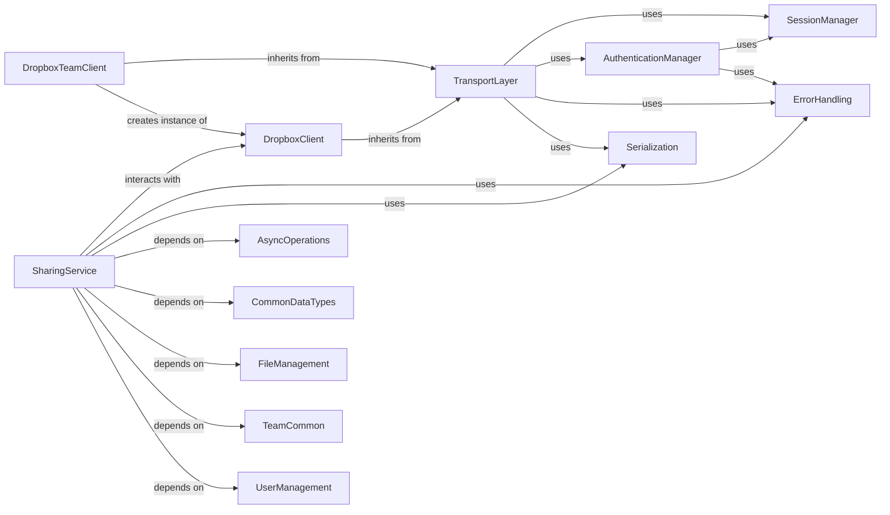

## Component Details

This graph illustrates the architecture of the Dropbox API client, focusing on how various components interact to provide a comprehensive set of functionalities. The core of the client is the `DropboxClient` and `DropboxTeamClient`, which leverage a `TransportLayer` for all network communications. The `TransportLayer` relies on `SessionManager` for HTTP session handling, `AuthenticationManager` for secure access, `ErrorHandling` for robust error management, and `Serialization` for data formatting. Specialized services like `SharingService`, `FileManagement`, and `UserManagement` interact with the `DropboxClient` to perform domain-specific operations, often depending on common data types and asynchronous operation handling. The overall flow involves client requests being processed by the transport layer, authenticated, serialized, sent over the network, and then responses are deserialized and errors are handled before being returned to the client.

### DropboxClient
The primary client for interacting with the Dropbox API on behalf of a user. It inherits core transport capabilities and provides methods for various user-specific operations.

**Related Classes/Methods**:

- <a href="https://github.com/dropbox/dropbox-sdk-python/blob/master/dropbox/dropbox_client.py#L725-L731" target="_blank" rel="noopener noreferrer">`dropbox.dropbox_client.Dropbox` (725:731)</a>

### DropboxTeamClient
Extends the base Dropbox client to provide functionalities specific to team administration, including the ability to perform actions as a team member or administrator.

**Related Classes/Methods**:

- <a href="https://github.com/dropbox/dropbox-sdk-python/blob/master/dropbox/dropbox_client.py#L733-L791" target="_blank" rel="noopener noreferrer">`dropbox.dropbox_client.DropboxTeam` (733:791)</a>
- <a href="https://github.com/dropbox/dropbox-sdk-python/blob/master/dropbox/dropbox_client.py#L739-L750" target="_blank" rel="noopener noreferrer">`dropbox.dropbox_client.DropboxTeam.as_admin` (739:750)</a>
- <a href="https://github.com/dropbox/dropbox-sdk-python/blob/master/dropbox/dropbox_client.py#L752-L763" target="_blank" rel="noopener noreferrer">`dropbox.dropbox_client.DropboxTeam.as_user` (752:763)</a>
- <a href="https://github.com/dropbox/dropbox-sdk-python/blob/master/dropbox/dropbox_client.py#L765-L791" target="_blank" rel="noopener noreferrer">`dropbox.dropbox_client.DropboxTeam._get_dropbox_client_with_select_header` (765:791)</a>

### TransportLayer
This component is responsible for the low-level details of communicating with the Dropbox API. It handles constructing HTTP requests, setting headers, managing different API hosts (API, Content, Notify), and retrying failed requests.

**Related Classes/Methods**:

- <a href="https://github.com/dropbox/dropbox-sdk-python/blob/master/dropbox/dropbox_client.py#L120-L722" target="_blank" rel="noopener noreferrer">`dropbox.dropbox_client._DropboxTransport` (120:722)</a>
- <a href="https://github.com/dropbox/dropbox-sdk-python/blob/master/dropbox/dropbox_client.py#L276-L358" target="_blank" rel="noopener noreferrer">`dropbox.dropbox_client._DropboxTransport.request` (276:358)</a>
- <a href="https://github.com/dropbox/dropbox-sdk-python/blob/master/dropbox/dropbox_client.py#L456-L516" target="_blank" rel="noopener noreferrer">`dropbox.dropbox_client._DropboxTransport.request_json_string_with_retry` (456:516)</a>
- <a href="https://github.com/dropbox/dropbox-sdk-python/blob/master/dropbox/dropbox_client.py#L518-L611" target="_blank" rel="noopener noreferrer">`dropbox.dropbox_client._DropboxTransport.request_json_string` (518:611)</a>
- <a href="https://github.com/dropbox/dropbox-sdk-python/blob/master/dropbox/dropbox_client.py#L662-L673" target="_blank" rel="noopener noreferrer">`dropbox.dropbox_client._DropboxTransport._get_route_url` (662:673)</a>

### SessionManager
Manages the underlying HTTP session, including connection pooling, proxy settings, and SSL certificate handling. It ensures efficient and secure communication with the Dropbox API.

**Related Classes/Methods**:

- <a href="https://github.com/dropbox/dropbox-sdk-python/blob/master/dropbox/session.py#L1-L1000" target="_blank" rel="noopener noreferrer">`dropbox.session.create_session` (1:1000)</a>
- <a href="https://github.com/dropbox/dropbox-sdk-python/blob/master/dropbox/session.py#L53-L67" target="_blank" rel="noopener noreferrer">`dropbox.session.pinned_session` (53:67)</a>

### AuthenticationManager
Handles the authentication aspects of the API client, specifically managing OAuth2 access tokens. This includes checking for token expiration and automatically refreshing tokens using a refresh token and app credentials.

**Related Classes/Methods**:

- <a href="https://github.com/dropbox/dropbox-sdk-python/blob/master/dropbox/dropbox_client.py#L360-L372" target="_blank" rel="noopener noreferrer">`dropbox.dropbox_client._DropboxTransport.check_and_refresh_access_token` (360:372)</a>
- <a href="https://github.com/dropbox/dropbox-sdk-python/blob/master/dropbox/dropbox_client.py#L374-L411" target="_blank" rel="noopener noreferrer">`dropbox.dropbox_client._DropboxTransport.refresh_access_token` (374:411)</a>

### ErrorHandling
Responsible for interpreting HTTP responses from the Dropbox API and raising appropriate Python exceptions (e.g., ApiError, AuthError, RateLimitError, HttpError) based on status codes and error payloads.

**Related Classes/Methods**:

- <a href="https://github.com/dropbox/dropbox-sdk-python/blob/master/dropbox/dropbox_client.py#L613-L660" target="_blank" rel="noopener noreferrer">`dropbox.dropbox_client._DropboxTransport.raise_dropbox_error_for_resp` (613:660)</a>
- <a href="https://github.com/dropbox/dropbox-sdk-python/blob/master/dropbox/exceptions.py#L14-L33" target="_blank" rel="noopener noreferrer">`dropbox.exceptions.ApiError` (14:33)</a>
- <a href="https://github.com/dropbox/dropbox-sdk-python/blob/master/dropbox/exceptions.py#L71-L79" target="_blank" rel="noopener noreferrer">`dropbox.exceptions.AuthError` (71:79)</a>
- <a href="https://github.com/dropbox/dropbox-sdk-python/blob/master/dropbox/exceptions.py#L60-L68" target="_blank" rel="noopener noreferrer">`dropbox.exceptions.BadInputError` (60:68)</a>
- <a href="https://github.com/dropbox/dropbox-sdk-python/blob/master/dropbox/exceptions.py#L36-L46" target="_blank" rel="noopener noreferrer">`dropbox.exceptions.HttpError` (36:46)</a>
- <a href="https://github.com/dropbox/dropbox-sdk-python/blob/master/dropbox/exceptions.py#L49-L57" target="_blank" rel="noopener noreferrer">`dropbox.exceptions.PathRootError` (49:57)</a>
- <a href="https://github.com/dropbox/dropbox-sdk-python/blob/master/dropbox/exceptions.py#L95-L100" target="_blank" rel="noopener noreferrer">`dropbox.exceptions.InternalServerError` (95:100)</a>
- <a href="https://github.com/dropbox/dropbox-sdk-python/blob/master/dropbox/exceptions.py#L82-L92" target="_blank" rel="noopener noreferrer">`dropbox.exceptions.RateLimitError` (82:92)</a>

### Serialization
Manages the serialization of Python objects into JSON for outgoing API requests and deserialization of JSON responses back into Python objects, adhering to the Stone specification.

**Related Classes/Methods**:

- `stone.backends.python_rsrc.stone_serializers.json_encode` (1:1000)
- `stone.backends.python_rsrc.stone_serializers.json_compat_obj_decode` (1:1000)

### SharingService
Provides methods for sharing files and folders, managing shared links, and controlling member access to shared content. It encapsulates the logic and data structures required for Dropbox's sharing functionalities.

**Related Classes/Methods**:

- <a href="https://github.com/dropbox/dropbox-sdk-python/blob/master/dropbox/sharing.py#L1-L1000" target="_blank" rel="noopener noreferrer">`dropbox.sharing` (1:1000)</a>
- <a href="https://github.com/dropbox/dropbox-sdk-python/blob/master/dropbox/sharing.py#L1-L1000" target="_blank" rel="noopener noreferrer">`dropbox.sharing.AddFileMemberError` (1:1000)</a>
- <a href="https://github.com/dropbox/dropbox-sdk-python/blob/master/dropbox/sharing.py#L1-L1000" target="_blank" rel="noopener noreferrer">`dropbox.sharing.AddFolderMemberError` (1:1000)</a>
- <a href="https://github.com/dropbox/dropbox-sdk-python/blob/master/dropbox/sharing.py#L1-L1000" target="_blank" rel="noopener noreferrer">`dropbox.sharing.CreateSharedLinkError` (1:1000)</a>
- <a href="https://github.com/dropbox/dropbox-sdk-python/blob/master/dropbox/sharing.py#L1-L1000" target="_blank" rel="noopener noreferrer">`dropbox.sharing.RemoveFileMemberError` (1:1000)</a>
- <a href="https://github.com/dropbox/dropbox-sdk-python/blob/master/dropbox/sharing.py#L1-L1000" target="_blank" rel="noopener noreferrer">`dropbox.sharing.ShareFolderError` (1:1000)</a>
- <a href="https://github.com/dropbox/dropbox-sdk-python/blob/master/dropbox/sharing.py#L1-L1000" target="_blank" rel="noopener noreferrer">`dropbox.sharing.SharedLinkMetadata` (1:1000)</a>
- <a href="https://github.com/dropbox/dropbox-sdk-python/blob/master/dropbox/sharing.py#L1-L1000" target="_blank" rel="noopener noreferrer">`dropbox.sharing.SharedFolderMetadata` (1:1000)</a>
- <a href="https://github.com/dropbox/dropbox-sdk-python/blob/master/dropbox/sharing.py#L100-L150" target="_blank" rel="noopener noreferrer">`dropbox.sharing.AddFileMemberArgs` (100:150)</a>
- <a href="https://github.com/dropbox/dropbox-sdk-python/blob/master/dropbox/sharing.py#L200-L240" target="_blank" rel="noopener noreferrer">`dropbox.sharing.AddFolderMemberArg` (200:240)</a>
- <a href="https://github.com/dropbox/dropbox-sdk-python/blob/master/dropbox/sharing.py#L40-L97" target="_blank" rel="noopener noreferrer">`dropbox.sharing.AccessLevel` (40:97)</a>
- <a href="https://github.com/dropbox/dropbox-sdk-python/blob/master/dropbox/sharing.py#L400-L430" target="_blank" rel="noopener noreferrer">`dropbox.sharing.RequestedVisibility` (400:430)</a>
- <a href="https://github.com/dropbox/dropbox-sdk-python/blob/master/dropbox/sharing.py#L1-L1000" target="_blank" rel="noopener noreferrer">`dropbox.sharing.LinkMetadata` (1:1000)</a>
- <a href="https://github.com/dropbox/dropbox-sdk-python/blob/master/dropbox/sharing.py#L1-L1000" target="_blank" rel="noopener noreferrer">`dropbox.sharing.SharedLinkError` (1:1000)</a>
- <a href="https://github.com/dropbox/dropbox-sdk-python/blob/master/dropbox/sharing.py#L1-L1000" target="_blank" rel="noopener noreferrer">`dropbox.sharing.MembershipInfo` (1:1000)</a>
- <a href="https://github.com/dropbox/dropbox-sdk-python/blob/master/dropbox/sharing.py#L1-L1000" target="_blank" rel="noopener noreferrer">`dropbox.sharing.ShareFolderErrorBase` (1:1000)</a>
- <a href="https://github.com/dropbox/dropbox-sdk-python/blob/master/dropbox/sharing.py#L1-L1000" target="_blank" rel="noopener noreferrer">`dropbox.sharing.SharedContentLinkMetadataBase` (1:1000)</a>
- <a href="https://github.com/dropbox/dropbox-sdk-python/blob/master/dropbox/sharing.py#L1-L1000" target="_blank" rel="noopener noreferrer">`dropbox.sharing.SharedFolderMetadataBase` (1:1000)</a>
- <a href="https://github.com/dropbox/dropbox-sdk-python/blob/master/dropbox/sharing.py#L1-L1000" target="_blank" rel="noopener noreferrer">`dropbox.sharing.VisibilityPolicyDisallowedReason` (1:1000)</a>
- <a href="https://github.com/dropbox/dropbox-sdk-python/blob/master/dropbox/sharing.py#L1-L1000" target="_blank" rel="noopener noreferrer">`dropbox.sharing.ListFolderMembersCursorArg` (1:1000)</a>
- <a href="https://github.com/dropbox/dropbox-sdk-python/blob/master/dropbox/sharing.py#L1-L1000" target="_blank" rel="noopener noreferrer">`dropbox.sharing.ShareFolderArgBase` (1:1000)</a>

### AsyncOperations
Manages asynchronous operations, including polling for job statuses and launching asynchronous tasks.

**Related Classes/Methods**:

- <a href="https://github.com/dropbox/dropbox-sdk-python/blob/master/dropbox/async_.py#L1-L1000" target="_blank" rel="noopener noreferrer">`dropbox.async_` (1:1000)</a>
- <a href="https://github.com/dropbox/dropbox-sdk-python/blob/master/dropbox/async_.py#L124-L152" target="_blank" rel="noopener noreferrer">`dropbox.async_.PollResultBase` (124:152)</a>
- <a href="https://github.com/dropbox/dropbox-sdk-python/blob/master/dropbox/async_.py#L10-L62" target="_blank" rel="noopener noreferrer">`dropbox.async_.LaunchResultBase` (10:62)</a>

### CommonDataTypes
Provides common data structures and enumerations used across various Dropbox API modules.

**Related Classes/Methods**:

- <a href="https://github.com/dropbox/dropbox-sdk-python/blob/master/dropbox/common.py#L1-L1000" target="_blank" rel="noopener noreferrer">`dropbox.common` (1:1000)</a>

### FileManagement
Handles operations related to files, including metadata, uploads, downloads, and file properties.

**Related Classes/Methods**:

- <a href="https://github.com/dropbox/dropbox-sdk-python/blob/master/dropbox/files.py#L1-L1000" target="_blank" rel="noopener noreferrer">`dropbox.files` (1:1000)</a>

### TeamCommon
Provides common data structures and utilities specifically for team-related functionalities.

**Related Classes/Methods**:

- <a href="https://github.com/dropbox/dropbox-sdk-python/blob/master/dropbox/team_common.py#L1-L1000" target="_blank" rel="noopener noreferrer">`dropbox.team_common` (1:1000)</a>
- <a href="https://github.com/dropbox/dropbox-sdk-python/blob/master/dropbox/team_common.py#L75-L135" target="_blank" rel="noopener noreferrer">`dropbox.team_common.GroupSummary` (75:135)</a>

### UserManagement
Manages user-specific information and operations, including account details and user-related common data types.

**Related Classes/Methods**:

- <a href="https://github.com/dropbox/dropbox-sdk-python/blob/master/dropbox/users.py#L1-L1000" target="_blank" rel="noopener noreferrer">`dropbox.users` (1:1000)</a>
- <a href="https://github.com/dropbox/dropbox-sdk-python/blob/master/dropbox/users_common.py#L1-L1000" target="_blank" rel="noopener noreferrer">`dropbox.users_common` (1:1000)</a>

### [FAQ](https://github.com/CodeBoarding/GeneratedOnBoardings/tree/main?tab=readme-ov-file#faq)