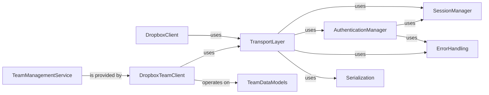

## Component Details

This graph illustrates the architecture of the Dropbox API client, focusing on how different components interact to provide functionalities for user and team administration. The core `DropboxClient` and `DropboxTeamClient` leverage a `TransportLayer` for communication, which in turn relies on `SessionManager` for HTTP sessions, `AuthenticationManager` for token handling, `ErrorHandling` for exception management, and `Serialization` for data formatting. The `TeamManagementService` represents the high-level business logic for team operations, utilizing the `DropboxTeamClient` and operating on `TeamDataModels`.

### DropboxClient
The primary client for interacting with the Dropbox API on behalf of a user. It provides methods for various user-specific operations.

**Related Classes/Methods**:

- <a href="https://github.com/dropbox/dropbox-sdk-python/blob/master/dropbox/dropbox_client.py#L725-L731" target="_blank" rel="noopener noreferrer">`dropbox.dropbox_client.Dropbox` (725:731)</a>

### DropboxTeamClient
A specialized client for team administration, providing methods to manage team members, groups, devices, and legal holds. It builds upon the core Dropbox client functionalities.

**Related Classes/Methods**:

- <a href="https://github.com/dropbox/dropbox-sdk-python/blob/master/dropbox/dropbox_client.py#L733-L791" target="_blank" rel="noopener noreferrer">`dropbox.dropbox_client.DropboxTeam` (733:791)</a>
- <a href="https://github.com/dropbox/dropbox-sdk-python/blob/master/dropbox/dropbox_client.py#L739-L750" target="_blank" rel="noopener noreferrer">`dropbox.dropbox_client.DropboxTeam.as_admin` (739:750)</a>
- <a href="https://github.com/dropbox/dropbox-sdk-python/blob/master/dropbox/dropbox_client.py#L752-L763" target="_blank" rel="noopener noreferrer">`dropbox.dropbox_client.DropboxTeam.as_user` (752:763)</a>
- <a href="https://github.com/dropbox/dropbox-sdk-python/blob/master/dropbox/dropbox_client.py#L765-L791" target="_blank" rel="noopener noreferrer">`dropbox.dropbox_client.DropboxTeam._get_dropbox_client_with_select_header` (765:791)</a>

### TeamManagementService
Offers comprehensive functionalities for administering Dropbox teams, including managing members, groups, devices, and legal holds. This component represents the high-level business logic for team operations.

**Related Classes/Methods**:

- `dropbox.team` (full file reference)
- `dropbox.team.TeamMemberProfile` (full file reference)
- `dropbox.team.GroupFullInfo` (full file reference)
- <a href="https://github.com/dropbox/dropbox-sdk-python/blob/master/dropbox/team.py#L21-L81" target="_blank" rel="noopener noreferrer">`dropbox.team.DeviceSession` (21:81)</a>
- <a href="https://github.com/dropbox/dropbox-sdk-python/blob/master/dropbox/team.py#L478-L500" target="_blank" rel="noopener noreferrer">`dropbox.team.AddSecondaryEmailsArg` (478:500)</a>
- <a href="https://github.com/dropbox/dropbox-sdk-python/blob/master/dropbox/team.py#L581-L642" target="_blank" rel="noopener noreferrer">`dropbox.team.AdminTier` (581:642)</a>
- <a href="https://github.com/dropbox/dropbox-sdk-python/blob/master/dropbox/team.py#L646-L715" target="_blank" rel="noopener noreferrer">`dropbox.team.ApiApp` (646:715)</a>

### TeamDataModels
This component encompasses the data structures (classes) used to represent various entities within the Dropbox team administration context, such as team members, groups, devices, and legal holds. These models are used for both request arguments and response payloads.

**Related Classes/Methods**:

- `dropbox.team.TeamMemberProfile` (full file reference)
- `dropbox.team.GroupFullInfo` (full file reference)
- <a href="https://github.com/dropbox/dropbox-sdk-python/blob/master/dropbox/team.py#L21-L81" target="_blank" rel="noopener noreferrer">`dropbox.team.DeviceSession` (21:81)</a>
- <a href="https://github.com/dropbox/dropbox-sdk-python/blob/master/dropbox/team.py#L478-L500" target="_blank" rel="noopener noreferrer">`dropbox.team.AddSecondaryEmailsArg` (478:500)</a>
- <a href="https://github.com/dropbox/dropbox-sdk-python/blob/master/dropbox/team.py#L581-L642" target="_blank" rel="noopener noreferrer">`dropbox.team.AdminTier` (581:642)</a>
- <a href="https://github.com/dropbox/dropbox-sdk-python/blob/master/dropbox/team.py#L646-L715" target="_blank" rel="noopener noreferrer">`dropbox.team.ApiApp` (646:715)</a>

### TransportLayer
This component is responsible for the low-level details of communicating with the Dropbox API. It handles constructing HTTP requests, setting headers, managing different API hosts (API, Content, Notify), and retrying failed requests.

**Related Classes/Methods**:

- <a href="https://github.com/dropbox/dropbox-sdk-python/blob/master/dropbox/dropbox_client.py#L120-L722" target="_blank" rel="noopener noreferrer">`dropbox.dropbox_client._DropboxTransport` (120:722)</a>
- <a href="https://github.com/dropbox/dropbox-sdk-python/blob/master/dropbox/dropbox_client.py#L276-L358" target="_blank" rel="noopener noreferrer">`dropbox.dropbox_client._DropboxTransport.request` (276:358)</a>
- <a href="https://github.com/dropbox/dropbox-sdk-python/blob/master/dropbox/dropbox_client.py#L456-L516" target="_blank" rel="noopener noreferrer">`dropbox.dropbox_client._DropboxTransport.request_json_string_with_retry` (456:516)</a>
- <a href="https://github.com/dropbox/dropbox-sdk-python/blob/master/dropbox/dropbox_client.py#L518-L611" target="_blank" rel="noopener noreferrer">`dropbox.dropbox_client._DropboxTransport.request_json_string` (518:611)</a>
- <a href="https://github.com/dropbox/dropbox-sdk-python/blob/master/dropbox/dropbox_client.py#L662-L673" target="_blank" rel="noopener noreferrer">`dropbox.dropbox_client._DropboxTransport._get_route_url` (662:673)</a>

### SessionManager
Manages the underlying HTTP session, including connection pooling, proxy settings, and SSL certificate handling. It ensures efficient and secure communication with the Dropbox API.

**Related Classes/Methods**:

- <a href="https://github.com/dropbox/dropbox-sdk-python/blob/master/dropbox/dropbox_client.py#L100-L118" target="_blank" rel="noopener noreferrer">`dropbox.dropbox_client.create_session` (100:118)</a>
- <a href="https://github.com/dropbox/dropbox-sdk-python/blob/master/dropbox/session.py#L53-L67" target="_blank" rel="noopener noreferrer">`dropbox.session.pinned_session` (53:67)</a>

### AuthenticationManager
Handles the authentication aspects of the API client, specifically managing OAuth2 access tokens. This includes checking for token expiration and automatically refreshing tokens using a refresh token and app credentials.

**Related Classes/Methods**:

- <a href="https://github.com/dropbox/dropbox-sdk-python/blob/master/dropbox/dropbox_client.py#L360-L372" target="_blank" rel="noopener noreferrer">`dropbox.dropbox_client._DropboxTransport.check_and_refresh_access_token` (360:372)</a>
- <a href="https://github.com/dropbox/dropbox-sdk-python/blob/master/dropbox/dropbox_client.py#L374-L411" target="_blank" rel="noopener noreferrer">`dropbox.dropbox_client._DropboxTransport.refresh_access_token` (374:411)</a>

### ErrorHandling
Responsible for interpreting HTTP responses from the Dropbox API and raising appropriate Python exceptions (e.g., ApiError, AuthError, RateLimitError, HttpError) based on status codes and error payloads.

**Related Classes/Methods**:

- <a href="https://github.com/dropbox/dropbox-sdk-python/blob/master/dropbox/dropbox_client.py#L613-L660" target="_blank" rel="noopener noreferrer">`dropbox.dropbox_client._DropboxTransport.raise_dropbox_error_for_resp` (613:660)</a>
- <a href="https://github.com/dropbox/dropbox-sdk-python/blob/master/dropbox/exceptions.py#L14-L33" target="_blank" rel="noopener noreferrer">`dropbox.exceptions.ApiError` (14:33)</a>
- <a href="https://github.com/dropbox/dropbox-sdk-python/blob/master/dropbox/exceptions.py#L71-L79" target="_blank" rel="noopener noreferrer">`dropbox.exceptions.AuthError` (71:79)</a>
- <a href="https://github.com/dropbox/dropbox-sdk-python/blob/master/dropbox/exceptions.py#L60-L68" target="_blank" rel="noopener noreferrer">`dropbox.exceptions.BadInputError` (60:68)</a>
- <a href="https://github.com/dropbox/dropbox-sdk-python/blob/master/dropbox/exceptions.py#L36-L46" target="_blank" rel="noopener noreferrer">`dropbox.exceptions.HttpError` (36:46)</a>
- <a href="https://github.com/dropbox/dropbox-sdk-python/blob/master/dropbox/exceptions.py#L49-L57" target="_blank" rel="noopener noreferrer">`dropbox.exceptions.PathRootError` (49:57)</a>
- <a href="https://github.com/dropbox/dropbox-sdk-python/blob/master/dropbox/exceptions.py#L95-L100" target="_blank" rel="noopener noreferrer">`dropbox.exceptions.InternalServerError` (95:100)</a>
- <a href="https://github.com/dropbox/dropbox-sdk-python/blob/master/dropbox/exceptions.py#L82-L92" target="_blank" rel="noopener noreferrer">`dropbox.exceptions.RateLimitError` (82:92)</a>

### Serialization
Manages the serialization of Python objects into JSON for outgoing API requests and deserialization of JSON responses back into Python objects, adhering to the Stone specification.

**Related Classes/Methods**:

- `stone.backends.python_rsrc.stone_serializers.json_encode` (full file reference)
- `stone.backends.python_rsrc.stone_serializers.json_compat_obj_decode` (full file reference)

### [FAQ](https://github.com/CodeBoarding/GeneratedOnBoardings/tree/main?tab=readme-ov-file#faq)