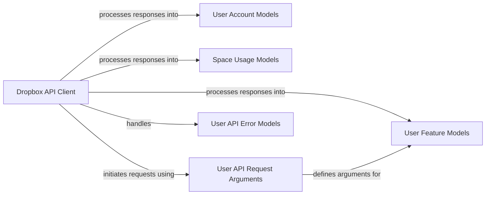

## Component Details

The UserAccountService subsystem in Dropbox manages user account information, including profile details, space usage, and user-specific features. It primarily interacts with the Dropbox API through a client to retrieve and process user-related data. The core functionality revolves around defining data models for various user entities, handling API request arguments, and processing API responses, including potential errors. This subsystem ensures that user account data is structured, validated, and accessible for application features.

### User Account Models
This component defines the data structures representing different types of user accounts within Dropbox, including a base account, basic account details, full account information, and related entities like user names and team details. It handles the structure and validation of user profile data.

**Related Classes/Methods**:

- <a href="https://github.com/dropbox/dropbox-sdk-python/blob/master/dropbox/users.py#L15-L60" target="_blank" rel="noopener noreferrer">`dropbox.users.Account` (15:60)</a>
- `dropbox.users.BasicAccount` (full file reference)
- <a href="https://github.com/dropbox/dropbox-sdk-python/blob/master/dropbox/users.py#L150-L220" target="_blank" rel="noopener noreferrer">`dropbox.users.FullAccount` (150:220)</a>
- <a href="https://github.com/dropbox/dropbox-sdk-python/blob/master/dropbox/users.py#L440-L470" target="_blank" rel="noopener noreferrer">`dropbox.users.Name` (440:470)</a>
- <a href="https://github.com/dropbox/dropbox-sdk-python/blob/master/dropbox/users.py#L290-L310" target="_blank" rel="noopener noreferrer">`dropbox.users.Team` (290:310)</a>
- <a href="https://github.com/dropbox/dropbox-sdk-python/blob/master/dropbox/users.py#L310-L340" target="_blank" rel="noopener noreferrer">`dropbox.users.FullTeam` (310:340)</a>

### User Feature Models
This component encapsulates data structures related to various features available to Dropbox users, such as file locking and Paper as files. It includes the feature enumeration and their corresponding value models.

**Related Classes/Methods**:

- <a href="https://github.com/dropbox/dropbox-sdk-python/blob/master/dropbox/users.py#L210-L240" target="_blank" rel="noopener noreferrer">`dropbox.users.FileLockingValue` (210:240)</a>
- <a href="https://github.com/dropbox/dropbox-sdk-python/blob/master/dropbox/users.py#L470-L490" target="_blank" rel="noopener noreferrer">`dropbox.users.PaperAsFilesValue` (470:490)</a>
- <a href="https://github.com/dropbox/dropbox-sdk-python/blob/master/dropbox/users.py#L500-L520" target="_blank" rel="noopener noreferrer">`dropbox.users.UserFeature` (500:520)</a>
- <a href="https://github.com/dropbox/dropbox-sdk-python/blob/master/dropbox/users.py#L15-L50" target="_blank" rel="noopener noreferrer">`dropbox.users.UserFeatureValue` (15:50)</a>

### Space Usage Models
This component defines the data structures related to user and team space allocation and usage within Dropbox, including details on used space and different allocation types.

**Related Classes/Methods**:

- <a href="https://github.com/dropbox/dropbox-sdk-python/blob/master/dropbox/users.py#L400-L420" target="_blank" rel="noopener noreferrer">`dropbox.users.SpaceUsage` (400:420)</a>
- <a href="https://github.com/dropbox/dropbox-sdk-python/blob/master/dropbox/users.py#L490-L520" target="_blank" rel="noopener noreferrer">`dropbox.users.SpaceAllocation` (490:520)</a>
- <a href="https://github.com/dropbox/dropbox-sdk-python/blob/master/dropbox/users.py#L420-L440" target="_blank" rel="noopener noreferrer">`dropbox.users.IndividualSpaceAllocation` (420:440)</a>
- <a href="https://github.com/dropbox/dropbox-sdk-python/blob/master/dropbox/users.py#L550-L590" target="_blank" rel="noopener noreferrer">`dropbox.users.TeamSpaceAllocation` (550:590)</a>

### User API Request Arguments
This component comprises the data structures used to define the input parameters for API calls related to user information and features. These arguments are serialized and sent to the Dropbox API.

**Related Classes/Methods**:

- <a href="https://github.com/dropbox/dropbox-sdk-python/blob/master/dropbox/users.py#L50-L80" target="_blank" rel="noopener noreferrer">`dropbox.users.UserFeaturesGetValuesBatchArg` (50:80)</a>
- <a href="https://github.com/dropbox/dropbox-sdk-python/blob/master/dropbox/users.py#L340-L360" target="_blank" rel="noopener noreferrer">`dropbox.users.GetAccountArg` (340:360)</a>
- <a href="https://github.com/dropbox/dropbox-sdk-python/blob/master/dropbox/users.py#L360-L380" target="_blank" rel="noopener noreferrer">`dropbox.users.GetAccountBatchArg` (360:380)</a>

### User API Error Models
This component defines the specific error types that can be returned by the Dropbox API when requests related to user accounts or features fail.

**Related Classes/Methods**:

- <a href="https://github.com/dropbox/dropbox-sdk-python/blob/master/dropbox/users.py#L380-L400" target="_blank" rel="noopener noreferrer">`dropbox.users.GetAccountBatchError` (380:400)</a>
- <a href="https://github.com/dropbox/dropbox-sdk-python/blob/master/dropbox/users.py#L80-L120" target="_blank" rel="noopener noreferrer">`dropbox.users.UserFeaturesGetValuesBatchError` (80:120)</a>
- <a href="https://github.com/dropbox/dropbox-sdk-python/blob/master/dropbox/users.py#L400-L420" target="_blank" rel="noopener noreferrer">`dropbox.users.GetAccountError` (400:420)</a>

### Dropbox API Client
This is the primary interface for applications to interact with the Dropbox API. It contains methods for making various API requests, including those for retrieving user account details, features, and space usage, and is responsible for dispatching these requests.

**Related Classes/Methods**:

- <a href="https://github.com/dropbox/dropbox-sdk-python/blob/master/dropbox/base.py#L31-L1000" target="_blank" rel="noopener noreferrer">`dropbox.base.DropboxBase` (31:1000)</a>
- <a href="https://github.com/dropbox/dropbox-sdk-python/blob/master/dropbox/users.py#L620-L630" target="_blank" rel="noopener noreferrer">`dropbox.users.features_get_values` (620:630)</a>
- <a href="https://github.com/dropbox/dropbox-sdk-python/blob/master/dropbox/users.py#L630-L640" target="_blank" rel="noopener noreferrer">`dropbox.users.get_account` (630:640)</a>
- <a href="https://github.com/dropbox/dropbox-sdk-python/blob/master/dropbox/users.py#L640-L650" target="_blank" rel="noopener noreferrer">`dropbox.users.get_account_batch` (640:650)</a>
- <a href="https://github.com/dropbox/dropbox-sdk-python/blob/master/dropbox/users.py#L650-L660" target="_blank" rel="noopener noreferrer">`dropbox.users.get_current_account` (650:660)</a>
- <a href="https://github.com/dropbox/dropbox-sdk-python/blob/master/dropbox/users.py#L660-L670" target="_blank" rel="noopener noreferrer">`dropbox.users.get_space_usage` (660:670)</a>

### [FAQ](https://github.com/CodeBoarding/GeneratedOnBoardings/tree/main?tab=readme-ov-file#faq)