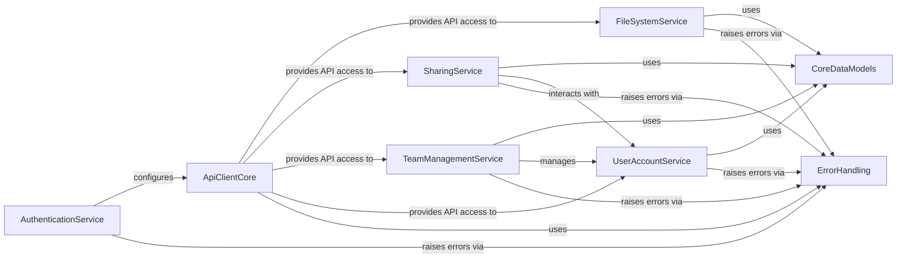

## Component Details

The `dropbox-sdk-python` facilitates programmatic interaction with the Dropbox API, providing a structured interface for authentication, file and folder management, sharing, and team administration. Its core functionality revolves around `ApiClientCore` which handles communication, while various service components manage specific API domains, all supported by shared data models and robust error handling.

### ApiClientCore
Provides the fundamental infrastructure for interacting with the Dropbox API, handling HTTP requests, session management, and token refreshing. It serves as the central communication hub for all API calls.

**Related Classes/Methods**:

- <a href="https://github.com/dropbox/dropbox-sdk-python/blob/master/dropbox/dropbox_client.py#L120-L722" target="_blank" rel="noopener noreferrer">`dropbox.dropbox_client._DropboxTransport` (120:722)</a>
- <a href="https://github.com/dropbox/dropbox-sdk-python/blob/master/dropbox/dropbox_client.py#L725-L731" target="_blank" rel="noopener noreferrer">`dropbox.dropbox_client.Dropbox` (725:731)</a>
- <a href="https://github.com/dropbox/dropbox-sdk-python/blob/master/dropbox/dropbox_client.py#L733-L791" target="_blank" rel="noopener noreferrer">`dropbox.dropbox_client.DropboxTeam` (733:791)</a>
- <a href="https://github.com/dropbox/dropbox-sdk-python/blob/master/dropbox/dropbox_client.py#L100-L118" target="_blank" rel="noopener noreferrer">`dropbox.dropbox_client.create_session` (100:118)</a>
- <a href="https://github.com/dropbox/dropbox-sdk-python/blob/master/dropbox/base.py#L31-L1000" target="_blank" rel="noopener noreferrer">`dropbox.base.DropboxBase` (31:1000)</a>
- <a href="https://github.com/dropbox/dropbox-sdk-python/blob/master/dropbox/base_team.py#L31-L1000" target="_blank" rel="noopener noreferrer">`dropbox.base_team.DropboxTeamBase` (31:1000)</a>
- <a href="https://github.com/dropbox/dropbox-sdk-python/blob/master/dropbox/session.py#L53-L67" target="_blank" rel="noopener noreferrer">`dropbox.session:pinned_session` (53:67)</a>

### AuthenticationService
Manages user authentication and authorization flows, including OAuth2 and PKCE, and defines various authentication-related errors. It ensures secure access to Dropbox resources.

**Related Classes/Methods**:

- <a href="https://github.com/dropbox/dropbox-sdk-python/blob/master/dropbox/oauth.py#L119-L263" target="_blank" rel="noopener noreferrer">`dropbox.oauth.DropboxOAuth2FlowBase` (119:263)</a>
- <a href="https://github.com/dropbox/dropbox-sdk-python/blob/master/dropbox/oauth.py#L266-L350" target="_blank" rel="noopener noreferrer">`dropbox.oauth.DropboxOAuth2FlowNoRedirect` (266:350)</a>
- <a href="https://github.com/dropbox/dropbox-sdk-python/blob/master/dropbox/oauth.py#L353-L536" target="_blank" rel="noopener noreferrer">`dropbox.oauth.DropboxOAuth2Flow` (353:536)</a>
- <a href="https://github.com/dropbox/dropbox-sdk-python/blob/master/dropbox/oauth.py#L80-L116" target="_blank" rel="noopener noreferrer">`dropbox.oauth.OAuth2FlowResult` (80:116)</a>
- <a href="https://github.com/dropbox/dropbox-sdk-python/blob/master/dropbox/auth.py#L10-L100" target="_blank" rel="noopener noreferrer">`dropbox.auth.AccessError` (10:100)</a>
- <a href="https://github.com/dropbox/dropbox-sdk-python/blob/master/dropbox/auth.py#L104-L229" target="_blank" rel="noopener noreferrer">`dropbox.auth.AuthError` (104:229)</a>

### FileSystemService
Encapsulates functionalities for managing files and folders within Dropbox, including creation, deletion, download, upload, metadata retrieval, search, and file locking.

**Related Classes/Methods**:

- `dropbox.files` (full file reference)
- <a href="https://github.com/dropbox/dropbox-sdk-python/blob/master/dropbox/files.py#L1000-L1000" target="_blank" rel="noopener noreferrer">`dropbox.files.FileMetadata` (1000:1000)</a>
- <a href="https://github.com/dropbox/dropbox-sdk-python/blob/master/dropbox/files.py#L1000-L1000" target="_blank" rel="noopener noreferrer">`dropbox.files.FolderMetadata` (1000:1000)</a>
- `dropbox.files.DeletedMetadata` (full file reference)
- <a href="https://github.com/dropbox/dropbox-sdk-python/blob/master/dropbox/files.py#L486-L517" target="_blank" rel="noopener noreferrer">`dropbox.files.CreateFolderArg` (486:517)</a>
- <a href="https://github.com/dropbox/dropbox-sdk-python/blob/master/dropbox/files.py#L322-L412" target="_blank" rel="noopener noreferrer">`dropbox.files.CommitInfo` (322:412)</a>
- <a href="https://github.com/dropbox/dropbox-sdk-python/blob/master/dropbox/files.py#L133-L197" target="_blank" rel="noopener noreferrer">`dropbox.files.GetMetadataArg` (133:197)</a>

### SharingService
Provides methods for sharing files and folders, managing shared links, and controlling member access to shared content.

**Related Classes/Methods**:

- `dropbox.sharing` (full file reference)
- `dropbox.sharing.AddFileMemberError` (full file reference)
- `dropbox.sharing.AddFolderMemberError` (full file reference)
- `dropbox.sharing.CreateSharedLinkError` (full file reference)
- `dropbox.sharing.RemoveFileMemberError` (full file reference)
- `dropbox.sharing.ShareFolderError` (full file reference)
- `dropbox.sharing.SharedLinkMetadata` (full file reference)
- `dropbox.sharing.SharedFolderMetadata` (full file reference)
- <a href="https://github.com/dropbox/dropbox-sdk-python/blob/master/dropbox/sharing.py#L100-L150" target="_blank" rel="noopener noreferrer">`dropbox.sharing.AddFileMemberArgs` (100:150)</a>
- <a href="https://github.com/dropbox/dropbox-sdk-python/blob/master/dropbox/sharing.py#L200-L240" target="_blank" rel="noopener noreferrer">`dropbox.sharing.AddFolderMemberArg` (200:240)</a>
- <a href="https://github.com/dropbox/dropbox-sdk-python/blob/master/dropbox/sharing.py#L40-L97" target="_blank" rel="noopener noreferrer">`dropbox.sharing.AccessLevel` (40:97)</a>
- <a href="https://github.com/dropbox/dropbox-sdk-python/blob/master/dropbox/sharing.py#L400-L430" target="_blank" rel="noopener noreferrer">`dropbox.sharing.RequestedVisibility` (400:430)</a>

### TeamManagementService
Offers comprehensive functionalities for administering Dropbox teams, including managing members, groups, devices, and legal holds.

**Related Classes/Methods**:

- `dropbox.team` (full file reference)
- `dropbox.team.TeamMemberProfile` (full file reference)
- `dropbox.team.GroupFullInfo` (full file reference)
- <a href="https://github.com/dropbox/dropbox-sdk-python/blob/master/dropbox/team.py#L21-L81" target="_blank" rel="noopener noreferrer">`dropbox.team.DeviceSession` (21:81)</a>
- <a href="https://github.com/dropbox/dropbox-sdk-python/blob/master/dropbox/team.py#L478-L500" target="_blank" rel="noopener noreferrer">`dropbox.team.AddSecondaryEmailsArg` (478:500)</a>
- <a href="https://github.com/dropbox/dropbox-sdk-python/blob/master/dropbox/team.py#L581-L642" target="_blank" rel="noopener noreferrer">`dropbox.team.AdminTier` (581:642)</a>
- <a href="https://github.com/dropbox/dropbox-sdk-python/blob/master/dropbox/team.py#L646-L715" target="_blank" rel="noopener noreferrer">`dropbox.team.ApiApp` (646:715)</a>

### UserAccountService
Manages individual user account information, including profile details, space usage, and user-specific features.

**Related Classes/Methods**:

- `dropbox.users` (full file reference)
- <a href="https://github.com/dropbox/dropbox-sdk-python/blob/master/dropbox/users.py#L150-L220" target="_blank" rel="noopener noreferrer">`dropbox.users.FullAccount` (150:220)</a>
- `dropbox.users.BasicAccount` (full file reference)
- <a href="https://github.com/dropbox/dropbox-sdk-python/blob/master/dropbox/users.py#L15-L60" target="_blank" rel="noopener noreferrer">`dropbox.users.Account` (15:60)</a>
- <a href="https://github.com/dropbox/dropbox-sdk-python/blob/master/dropbox/users.py#L400-L420" target="_blank" rel="noopener noreferrer">`dropbox.users.SpaceUsage` (400:420)</a>
- <a href="https://github.com/dropbox/dropbox-sdk-python/blob/master/dropbox/users.py#L500-L520" target="_blank" rel="noopener noreferrer">`dropbox.users.UserFeature` (500:520)</a>

### ErrorHandling
Defines a hierarchy of custom exceptions used throughout the SDK to represent various API errors and client-side issues, providing structured error reporting.

**Related Classes/Methods**:

- `dropbox.exceptions` (full file reference)
- <a href="https://github.com/dropbox/dropbox-sdk-python/blob/master/dropbox/exceptions.py#L1-L11" target="_blank" rel="noopener noreferrer">`dropbox.exceptions.DropboxException` (1:11)</a>
- <a href="https://github.com/dropbox/dropbox-sdk-python/blob/master/dropbox/exceptions.py#L14-L33" target="_blank" rel="noopener noreferrer">`dropbox.exceptions.ApiError` (14:33)</a>
- <a href="https://github.com/dropbox/dropbox-sdk-python/blob/master/dropbox/exceptions.py#L36-L46" target="_blank" rel="noopener noreferrer">`dropbox.exceptions.HttpError` (36:46)</a>
- <a href="https://github.com/dropbox/dropbox-sdk-python/blob/master/dropbox/exceptions.py#L71-L79" target="_blank" rel="noopener noreferrer">`dropbox.exceptions.AuthError` (71:79)</a>
- <a href="https://github.com/dropbox/dropbox-sdk-python/blob/master/dropbox/exceptions.py#L82-L92" target="_blank" rel="noopener noreferrer">`dropbox.exceptions.RateLimitError` (82:92)</a>

### CoreDataModels
Contains shared data models and utility classes used across different parts of the Dropbox SDK, promoting consistency and reusability.

**Related Classes/Methods**:

- `dropbox.common` (full file reference)
- `dropbox.team_common` (full file reference)
- `dropbox.users_common` (full file reference)
- <a href="https://github.com/dropbox/dropbox-sdk-python/blob/master/dropbox/common.py#L10-L116" target="_blank" rel="noopener noreferrer">`dropbox.common.PathRoot` (10:116)</a>
- <a href="https://github.com/dropbox/dropbox-sdk-python/blob/master/dropbox/common.py#L192-L228" target="_blank" rel="noopener noreferrer">`dropbox.common.RootInfo` (192:228)</a>
- <a href="https://github.com/dropbox/dropbox-sdk-python/blob/master/dropbox/team_common.py#L1-L1" target="_blank" rel="noopener noreferrer">`dropbox.team_common` (1:1)</a>
- <a href="https://github.com/dropbox/dropbox-sdk-python/blob/master/dropbox/users_common.py#L1-L1" target="_blank" rel="noopener noreferrer">`dropbox.users_common` (1:1)</a>

### [FAQ](https://github.com/CodeBoarding/GeneratedOnBoardings/tree/main?tab=readme-ov-file#faq)